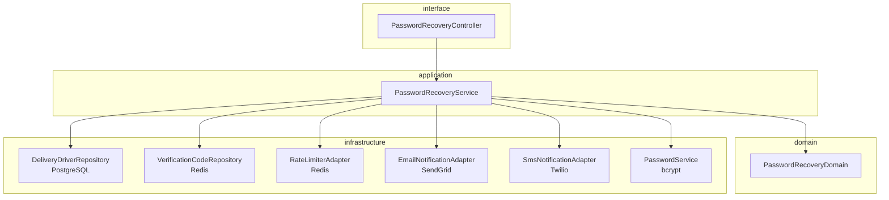
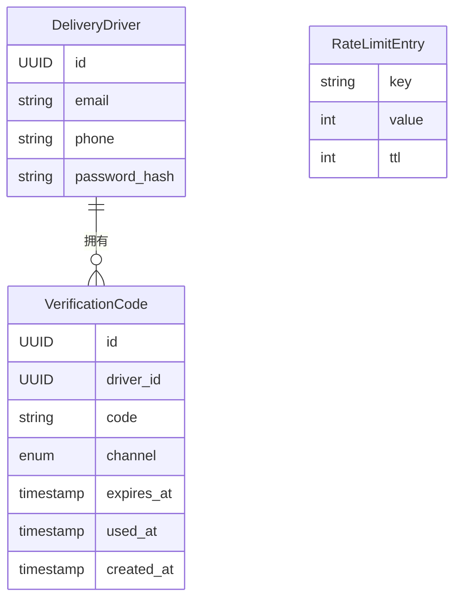
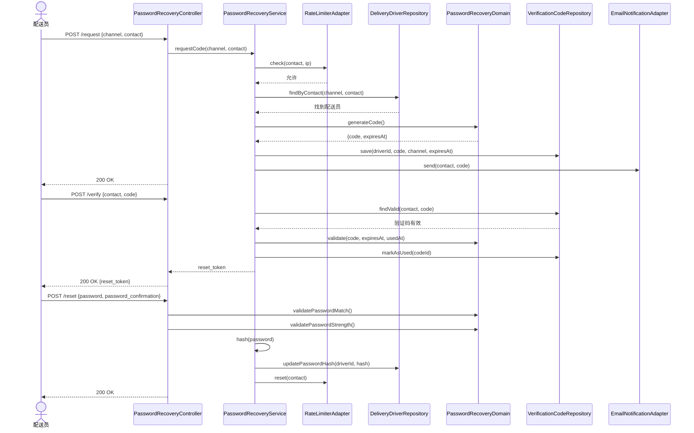

# 技术设计示例 — 密码恢复

> **注意：** 这是一个注释示例。`<!-- -->` 之间的注释解释了为什么每个部分
> 满足 `design-standards` skill 的检查清单。在实际设计中删除它们。
> 来源产物是：`prd.md`、`stories.md`、`scenarios.feature`、
> `requirements.md` 和 `nf-requirements.md`，feature 为 `recuperacao-de-senha`。

---

## 技术概述

<!-- ✅ 描述了技术方案（数字 OTP + 过期），而非用户做什么 -->
<!-- ✅ 提到了关键技术：OTP、bcrypt、Redis、邮件/SMS adapters -->
<!-- ✅ 引用了架构模式（hexagonal） -->
<!-- ✅ 与 constitution.md 一致（外部服务隔离在 adapters 中） -->
<!-- ✅ 3 句话 — 在 4 句的限制内 -->

密码恢复使用具有 5 分钟过期时间的一次性数字 OTP 验证码，
通过配送员选择的渠道（邮件或短信）经由隔离的基础设施 adapters 投递。
过度尝试控制使用基于 Redis 的速率限制实现，
按联系方式和 IP 持久化计数器，TTL 为 30 分钟。密码更新应用
bcrypt，最低成本为 100ms，无论联系方式是否已注册，
都返回中性确认响应，符合 NFR-3。

---

## 组件架构

<!-- ✅ flowchart TD 图显示所有层之间的依赖关系 -->
<!-- ✅ 每个组件有单一且清晰的职责 -->
<!-- ✅ 依赖指向内部（infra → application → domain） -->
<!-- ✅ 外部服务（邮件、短信）隔离在基础设施 adapters 中 -->
<!-- ✅ 所有 REQ 至少由一个组件处理 -->



### PasswordRecoveryController
- **层：** interface
- **职责：** 接收 HTTP 请求，验证载荷格式并委托给 PasswordRecoveryService
- **依赖：** PasswordRecoveryService

### PasswordRecoveryService
- **层：** application
- **职责：** 编排恢复流程：检查速率限制、查找账户、生成/验证 OTP、更新密码
- **依赖：** DeliveryDriverRepository (port)、VerificationCodeRepository (port)、NotificationPort (port)、PasswordService (port)、RateLimiterPort (port)

### PasswordRecoveryDomain
- **层：** domain
- **职责：** 封装业务规则：OTP 验证码有效性、密码最低要求、一次性使用规则
- **依赖：** —（无外部依赖）

### DeliveryDriverRepository
- **层：** infrastructure
- **职责：** 通过邮箱或电话查找配送员并更新密码哈希
- **依赖：** PostgreSQL (Prisma)

### VerificationCodeRepository
- **层：** infrastructure
- **职责：** 持久化、检索和失效 OTP 验证码，TTL 为 5 分钟
- **依赖：** Redis

### RateLimiterAdapter
- **层：** infrastructure
- **职责：** 按联系方式和 IP 控制并持久化尝试计数器，TTL 为 30 分钟
- **依赖：** Redis

### EmailNotificationAdapter
- **层：** infrastructure
- **职责：** 通过外部邮件服务发送 OTP 验证码
- **依赖：** 外部邮件服务（如：SendGrid）← *新 — 需要配置*

### SmsNotificationAdapter
- **层：** infrastructure
- **职责：** 通过外部短信服务发送 OTP 验证码
- **依赖：** 外部短信服务（如：Twilio）← *新 — 需要配置*

### PasswordService
- **层：** infrastructure
- **职责：** 使用 bcrypt 生成密码哈希（最低成本 100ms）并比较明文与哈希
- **依赖：** bcrypt

---

## 数据模型

<!-- ✅ erDiagram 图显示所有实体及关系 -->
<!-- ✅ 实体从需求和 BDD 场景推导，非编造 -->
<!-- ✅ 每个字段有类型和描述 -->
<!-- ✅ 过期 TTL 存在（NFR-2：5 分钟后失效） -->
<!-- ✅ `used_at` 字段确保一次性使用（REQ-10） -->
<!-- ✅ 无 DDL 或 migration 细节 -->



### VerificationCode
| 字段 | 类型 | 描述 |
|-------|------|-----------|
| id | UUID | 唯一标识符 |
| driver_id | UUID | 引用拥有该验证码的配送员 |
| code | string | 数字 OTP 验证码（6 位） |
| channel | enum | `email` \| `sms` — 发送渠道 |
| expires_at | timestamp | 过期时刻（生成 + 5 分钟） |
| used_at | timestamp \| null | 成功使用时填充；未使用则为 null |
| created_at | timestamp | 生成日期 |

**关系：** 通过 `driver_id` 与 `DeliveryDriver` N:1。一个配送员可以有多个验证码（之前的尝试），但只有最近未过期的才是有效的。

### RateLimitEntry (Redis)
| 字段 | 类型 | 描述 |
|-------|------|-----------|
| key | string | `rate_limit:contact:<联系方式哈希>` 或 `rate_limit:ip:<ip>` |
| value | int | 连续未成功尝试的计数器 |
| ttl | int | 30 分钟，以秒为单位；计数器归零时重置 |

> **注意：** `DeliveryDriver` 已通过 `register-user` feature 存在。此 feature 不更改
> 其结构 — 仅读取 邮箱/电话 并更新 `password_hash`。

---

## API / 契约

<!-- ✅ Endpoints 从 BDD 场景推导 -->
<!-- ✅ 载荷有字段和类型 -->
<!-- ✅ BDD 场景中的所有错误都有对应的 HTTP 状态码 -->
<!-- ✅ 请求 endpoint 上的中性响应明确（NFR-3） -->
<!-- ✅ 尝试阻止使用 429 状态码（NFR-4） -->
<!-- ✅ 所有 endpoints 声明了认证（公开） -->

### POST /api/v1/password-recovery/request
- **认证：** 公开
- **描述：** 请求发送 OTP 验证码。返回中性消息，无论联系方式是否存在（NFR-3）。
- **请求体：**
  ```json
  {
    "channel": "email | sms",
    "contact": "string"
  }
  ```
- **Response 200**（始终返回，无论是否已注册 — NFR-3）：
  ```json
  {
    "message": "如果此数据已注册，您将很快收到验证码。"
  }
  ```
- **错误：**
  | 状态码 | 条件 |
  |--------|----------|
  | 400 | 无效载荷：`channel` 缺失、`contact` 为空或格式对渠道无效（REQ-5） |
  | 429 | 达到速率限制：同一联系方式或 IP 连续 5 次尝试（NFR-4、REQ-11） |

---

### POST /api/v1/password-recovery/verify
- **认证：** 公开
- **描述：** 验证配送员提供的 OTP 验证码。
- **请求体：**
  ```json
  {
    "contact": "string",
    "code": "string"
  }
  ```
- **Response 200：**
  ```json
  {
    "reset_token": "string（用于授权重置的短期 token）"
  }
  ```
- **错误：**
  | 状态码 | 条件 |
  |--------|----------|
  | 400 | 无效载荷 |
  | 401 | 验证码无效、已过期或已使用（REQ-9、NFR-2） |

---

### POST /api/v1/password-recovery/reset
- **认证：** header 中的 `reset_token`（由 `/verify` endpoint 签发）
- **描述：** 在验证 OTP 后更新账户密码。
- **请求体：**
  ```json
  {
    "password": "string",
    "password_confirmation": "string"
  }
  ```
- **Response 200：**
  ```json
  {
    "message": "密码更新成功。"
  }
  ```
- **错误：**
  | 状态码 | 条件 |
  |--------|----------|
  | 400 | `password` 和 `password_confirmation` 不一致（REQ-7） |
  | 422 | `password` 不满足最低要求：8+ 字符、大写、小写、数字、特殊字符（REQ-8） |
  | 401 | `reset_token` 无效或已过期 |

---

## 执行流程

<!-- ✅ .feature 文件中每个 Scenario 一个流程 -->
<!-- ✅ 正常路径逐步描述，每步标明负责组件 -->
<!-- ✅ BDD 场景的所有替代流程已覆盖 -->
<!-- ✅ 使用后立即失效明确（REQ-10） -->
<!-- ✅ 未注册联系方式的响应中性明确（NFR-3） -->

### 流程：使用邮件和有效验证码恢复密码（正常路径）
1. **PasswordRecoveryController** 接收 `POST /request` 并验证载荷格式（channel + contact）
2. **PasswordRecoveryController** 调用 `PasswordRecoveryService.requestCode(channel, contact)`
3. **PasswordRecoveryService** 调用 `RateLimiterAdapter.check(contact, ip)` — 检查是否未被阻止
4. **PasswordRecoveryService** 调用 `DeliveryDriverRepository.findByContact(channel, contact)`
5. 如果联系方式**未注册**：**PasswordRecoveryService** 返回中性响应而不生成验证码（NFR-3）— 流程在步骤 9 结束
6. **PasswordRecoveryService** 调用 `PasswordRecoveryDomain.generateCode()` — 生成 6 位 OTP
7. **PasswordRecoveryService** 调用 `VerificationCodeRepository.save(driverId, code, channel, expiresAt)` — TTL：5 分钟
8. **PasswordRecoveryService** 调用 `EmailNotificationAdapter.send(contact, code)`（如果 channel = sms 则调用 `SmsNotificationAdapter`）
9. **PasswordRecoveryController** 返回 `200 OK` 及中性消息
10. **PasswordRecoveryController** 接收 `POST /verify`，包含 contact + code
11. **PasswordRecoveryService** 调用 `VerificationCodeRepository.findValid(contact, code)` — 查找未过期且未使用的验证码
12. **PasswordRecoveryDomain** 验证：验证码存在、`expires_at > now()`、`used_at` 为 null
13. **PasswordRecoveryService** 调用 `VerificationCodeRepository.markAsUsed(codeId)` — 立即使其失效（REQ-10）
14. **PasswordRecoveryService** 签发短期 `reset_token`（15 分钟）
15. **PasswordRecoveryController** 返回 `200 OK` 及 `{ reset_token }`
16. **PasswordRecoveryController** 接收 `POST /reset`，包含 password + password_confirmation + reset_token
17. **PasswordRecoveryDomain** 验证：字段一致（REQ-7）、密码满足最低要求（REQ-8）
18. **PasswordService** 生成 bcrypt 哈希，成本调整为 ≥ 100ms（NFR-5）
19. **DeliveryDriverRepository** 更新配送员的 `password_hash`
20. **RateLimiterAdapter** 重置联系方式的计数器（NFR-4 — 成功将阻止归零）
21. **PasswordRecoveryController** 返回 `200 OK` 及成功消息



**替代流程：**

- *无效格式请求（Scenario："无效格式数据"）*：步骤 1 验证失败 → Controller 返回 `400` 及无效格式消息（REQ-5）
- *联系方式未注册（Scenario："未注册数据"）*：步骤 5 — Service 返回与成功相同的中性响应，不生成验证码（NFR-3、REQ-6）
- *无效或过期验证码（Scenario："过期或无效验证码"）*：步骤 11 — `findValid` 返回 null → Service 抛出错误 → Controller 返回 `401`（REQ-9）
- *验证码重用（Scenario："使用后重用验证码"）*：步骤 12 — `used_at` 非 null → Domain 拒绝 → Controller 返回 `401`（REQ-10）
- *密码不一致（Scenario："确认字段不一致"）*：步骤 17 失败 → Controller 返回 `400`（REQ-7）
- *弱密码（Scenario："不满足最低要求"）*：步骤 17 失败，附带要求列表 → Controller 返回 `422`（REQ-8）
- *尝试阻止（Scenario："过度尝试阻止"）*：步骤 3 检测到 5 次尝试 → Service 返回阻止 → Controller 返回 `429`（NFR-4、REQ-11、REQ-12）

---

## 技术决策

<!-- ✅ 仅包含有真正权衡的决策 -->
<!-- ✅ 每个决策至少有 2 个替代方案 -->
<!-- ✅ 理由明确提及权衡 -->
<!-- ✅ 每个决策追溯到需求 -->

### DT-1：数字 OTP vs. 魔法链接
- **问题：** 如何实现身份验证机制以允许密码重置
- **考虑的替代方案：** (a) 6 位数字 OTP 验证码、(b) 通过邮件发送的魔法链接、(c) 安全问题
- **决策：** 6 位数字 OTP 验证码
- **理由：** OTP 适用于两种渠道（邮件和短信），而魔法链接在短信中不可行。权衡：OTP 在长窗口内略微更容易受到暴力破解 — 通过 5 分钟 TTL（NFR-2）和速率限制（NFR-4）缓解。
- **相关需求：** REQ-1、NFR-2

### DT-2：OTP 验证码存储
- **问题：** 在哪里持久化 OTP 验证码以允许验证和使用后失效
- **考虑的替代方案：** (a) 关系数据库（`verification_codes` 表）、(b) 具有原生 TTL 的 Redis
- **决策：** 关系数据库（`verification_codes` 表）
- **理由：** 允许日志可追溯性（NFR-6 要求保留 1 年）、尝试历史和审计。具有原生 TTL 的 Redis 会自动删除数据，无法满足要求的保留。权衡：读/写操作比 Redis 略慢，但在 30 秒 SLA（NFR-1）内。
- **相关需求：** NFR-6、REQ-10

### DT-3：速率限制 — 计数器存储
- **问题：** 在哪里持久化按联系方式和 IP 的速率限制尝试计数器
- **考虑的替代方案：** (a) 关系数据库、(b) 具有原生 TTL 的 Redis
- **决策：** Redis，TTL 为 30 分钟
- **理由：** 速率限制计数器本质上是短暂的（TTL = 阻止期），需要高频率低延迟的读/写。具有原生 TTL 的 Redis 消除了清理作业。权衡：如果 Redis 宕机，计数器丢失且阻止暂时无效 — 可接受，因为关系数据库仍持久化日志（NFR-6）。
- **相关需求：** NFR-4、REQ-11、REQ-12

### DT-4：OTP 验证后的重置 token
- **问题：** 如何在成功验证 OTP 验证码后授权 `/reset` endpoint，而不在第三步暴露 OTP
- **考虑的替代方案：** (a) 重用 OTP 验证码作为授权 token、(b) 验证后签发短期 JWT
- **决策：** 在 `/verify` endpoint 签发的短期 JWT（15 分钟）
- **理由：** 将 OTP 验证码（REQ-10 中使用后撤销）与重置授权机制隔离。具有短 TTL 的 JWT 限制了暴露窗口。权衡：为流程增加了一个额外的 token — 考虑到安全收益是可接受的。
- **相关需求：** REQ-2、REQ-10
