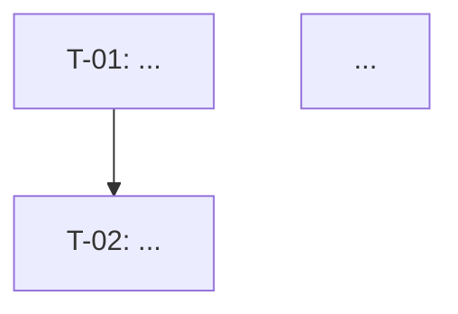

# 实现 Task 标准

## 格式规范

> 如果项目中存在 `docs/sdd/tasks-format.md`，读取它并将其用作格式规范 — 它替代以下默认格式，可能已为此项目定制。

## 默认格式

### 文件结构

```markdown
# Tasks — <Feature 名称>

## REQ-1 — <需求标题>

> <完整需求文本>

### T-01: <Task 标题>
- [ ] <描述>
**可追溯性:** ...
**依赖:** ...
**完成标准:** ...

---

## REQ-2 — <需求标题>
...

## 无直接 REQ 的 NFR   ← 仅当有未在上面覆盖的 NFR 时

...

## 依赖图   ← 从"依赖"字段自动推导


```

---

## 每个 task 的格式

```markdown
### T-<NN>: <祈使句、具体的标题>

- [ ] <需要做什么，1-3 句话。无代码。无泛泛而谈。>

**可追溯性:** <REQ-N> · <NFR-N> · <Scenario: "确切名称">
**依赖:** <T-NN, T-NN> 或 `—`
**完成标准:** <任何团队成员都可以验证的一句话。>
```

### 必需字段

| 字段 | 规则 |
|-------|-------|
| ID | 全局顺序：T-01, T-02...（不按块重新开始） |
| 标题 | 祈使句，具体。以动词开头："实现"、"创建"、"配置"、"覆盖" |
| 描述 | 1-3 句话。无代码。 |
| 可追溯性 | 至少一个 REQ 或 NFR。当是测试 task 时添加 Scenario。 |
| 依赖 | 阻塞的 ID，或 `—`。 |
| 完成标准 | 可验证的标准。不是"当准备好了"。 |

---

## 各类型 task 的检查清单

**模型/数据：**
- [ ] 每个新实体一个 task + 一个单独的 migration task
- [ ] 每个载荷验证 schema 一个 task（如：Zod）

**领域：**
- [ ] 每个领域方法一个 task
- [ ] 描述中无数据库、HTTP 或外部服务

**基础设施：**
- [ ] 每个 repository 方法一个 task（save、findValid 和 markAsUsed = 3 个 task）
- [ ] 每个外部服务 adapter 一个 task
- [ ] `nf-requirements.md` 中的每个 NFR 至少被一个 task 覆盖

**API：**
- [ ] 每个 endpoint 一个 task（path 重要）
- [ ] 每个相关错误处理器一个 task
- [ ] API task 依赖于其使用的基础设施 task

**测试：**
- [ ] `.feature` 中每个 Scenario 一个 task
- [ ] 每个有可测量标准的 NFR 一个 task
- [ ] E2E 测试 task 依赖于被测试的 endpoint
- [ ] **没有测试 task 是实现 task 的依赖项**

**UI（仅当存在 `docs/design-system/` 时）：**
- [ ] UI 组件引用要复用的 design system 组件
- [ ] Design token 在描述中被引用（非字面值）

---

## 分组规则

- 每个 task 放在其**主要**处理的 REQ 块中。
- 被多个 REQ 使用的 task → 编号最小的 REQ 的块。
- NFR → 相关 REQ 的块（NFR 的 `来源` 字段）；无直接 REQ → 末尾的独立块。

---

## 最低必需覆盖率

- [ ] 每个 REQ 有自己的块，至少 1 个 task
- [ ] 每个 NFR 至少被 1 个 task 覆盖
- [ ] 每个 Scenario 至少有 1 个测试 task
- [ ] `design.md` 中的每个新组件至少有 1 个 task
- [ ] 每个 endpoint 至少有 1 个实现 task 和 1 个测试 task
- [ ] 末尾有 `flowchart TD` 依赖图，从每个 task 的"依赖"字段推导

---

## 参考

- 产物格式（可定制）：`docs/sdd/tasks-format.md`
- 规范示例（可定制）：`docs/sdd/tasks-example.md`
- 索引细化指南：`references/interview-guide.md`
