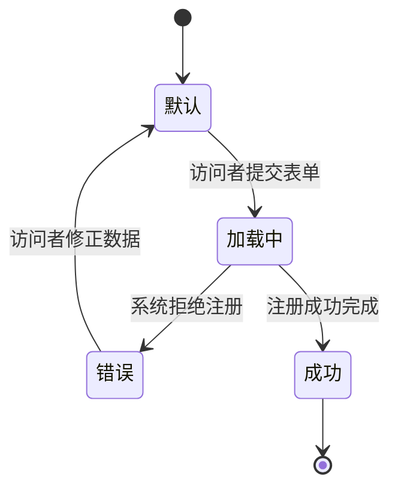

# `tela.md` 注释示例

Feature：**注册用户** | 屏幕：**注册页面**

> 此示例展示了 tela.md 的每一行如何追溯到 Scenario 或 PRD 段落。
> `>` 中的注释是解释性的 — 不出现在实际文件中。

---

# 注册页面

> 显示名称来自 Scenario：`Given 访问者在注册页面` 和 PRD（主流程："访问者访问注册页面"）。

---

## 概述

- **名称：** 注册页面
- **Slug：** pagina-de-cadastro
- **URL：** /register
- **目的：** 允许访问者通过提供个人数据和访问凭据来创建新账户。
- **相关 Scenarios：**
  - 通过首页链接访问注册表单
  - 使用有效数据完成注册
  - 表单中使用无效数据注册

---

## 组件

### 表单字段

| 字段 | 类型 | 必填 | 描述 |
|---|---|---|---|
| 姓名 | text | 是 | 访问者全名 |
| 邮箱 | email | 是 | 用于登录和确认的邮箱地址 |
| 密码 | password | 是 | 访问密码 — 至少 8 字符，包含大写、小写、数字和特殊字符 |
| 确认密码 | password | 是 | 重复密码以进行验证 |
| 出生日期 | date | 是 | 访问者出生日期 |
| 头像 | file | 否 | 可选的用户头像图片 |

> 直接从 Scenario "通过首页链接访问注册表单" 的 `Then` 推导：
> `Then 系统显示一个包含姓名、邮箱、密码、确认密码、出生日期和头像字段的表单`

### 按钮

| 标签 | 类型 | 行为 |
|---|---|---|
| 注册 | submit | 验证字段并提交表单；成功后显示邮件发送确认屏幕 |

### 导航链接

| 标签 | 目标 | 上下文 |
|---|---|---|
| 注册链接 | /register（此屏幕） | 在首页上呈现；将用户导向此屏幕 |

### 固定内容和消息

- 页面标题（如"创建账户"或"注册"）— 待设计确认
- 关于密码要求的说明（从密码错误消息推导）

---

## 状态

### 默认（initial）
表单显示所有字段为空且"注册"按钮已启用。
头像无预选图片。

### 加载中（loading）
访问者提交有效数据后，系统处理注册期间显示。
"注册"按钮在处理期间被禁用以防止重复提交。

### 错误

| 原因 | 显示的消息 |
|---|---|
| 邮箱已关联到现有账户 | `此邮箱已注册。请尝试登录或使用其他地址。` |
| 密码无特殊字符 | `密码必须至少包含 8 个字符，包括大写、小写、数字和特殊字符。` |
| 确认密码与输入的密码不一致 | `密码不一致。` |
| 姓名为空 | `姓名字段为必填。` |
| 出生日期为空 | `出生日期字段为必填。` |
| 邮箱格式无效 | `请输入有效的邮箱地址。` |

### 成功
访问者看到一个屏幕，告知确认链接已发送到其邮箱。
（访问者被带到确认页面 — 独立屏幕。）

---

## 考量

### 验证
- **邮箱：** 有效邮箱地址格式；不能已在系统中注册
- **密码：** 至少 8 字符，包括大写字母、小写字母、数字和特殊字符
- **确认密码：** 必须与密码字段相同
- **姓名：** 必填字段；不能为空
- **出生日期：** 必填字段；不能为空

### 可访问性
当前产物中未指定。有对应的非功能需求时填写。

### 响应性
当前产物中未指定。有对应的非功能需求时填写。

---

## 视觉参考

### 线框图
_待手动填写。_

### Mockup
_待手动填写。_

### 交互原型
_待手动填写。_
