# Design — AgentForge

## 技术概述

AgentForge 采用 Go 单二进制 CLI 架构（cobra + Docker SDK），通过 Docker Engine API 直接通信实现 AI coding agent 的容器全生命周期管理。核心技术方案是动态 Dockerfile 生成与 SDK 的 `ImageBuild` / `ContainerCreate` 类型安全调用，利用 Docker 容器化天然隔离不同 agent 的运行时依赖（Node.js、Python、Go），并通过 `endpoint` 子系统的文件级 CRUD 统一管理 LLM 服务商配置。系统依赖 Docker Engine (>=20.10) 的 daemon socket（`/var/run/docker.sock`）作为唯一外部容器运行时接口，无需 docker CLI 工具。所有操作通过 cobra 命令路由分发到构建、运行、端点和诊断四个独立模块，各模块共享一致的参数解析和持久化机制。

---

## 组件架构

```mermaid
flowchart TD
    subgraph entry[入口层 Entry Layer]
        CLI[CLI Router<br/>子命令路由]
        HELP[Help System<br/>帮助信息]
    end
    subgraph shared[共享层 Shared Layer]
        AP[Args Parser<br/>参数解析]
        DH[Docker Helper<br/>Docker 命令封装]
        CR[Config Resolver<br/>路径解析]
    end
    subgraph build[构建层 Build Layer]
        BE[BuildEngine<br/>构建编排]
        DF[Dockerfile Generator<br/>Dockerfile 动态生成]
        DEP[Deps Module<br/>依赖模块化安装]
    end
    subgraph run[运行层 Run Layer]
        RE[RunEngine<br/>容器运行编排]
        LA[Args Persistence<br/>.last_args 持久化]
        WR[Wrapper Loader<br/>Agent Wrapper 加载]
    end
    subgraph config[配置管理层 Config Layer]
        EM[EndpointManager<br/>端点 CRUD]
        PP[Provider-Agent Matrix<br/>服务商映射矩阵]
        AS[Apply Syncer<br/>配置同步器]
    end
    subgraph diag[诊断层 Diagnosis Layer]
        DE[DiagnosticEngine<br/>三层环境诊断]
        PM[Package Manager Adapter<br/>包管理器适配]
        DI[Deps Inspector<br/>容器内依赖查询]
    end
    subgraph dist[分发层 Distribution Layer]
        DIE[DistributionEngine<br/>镜像导入导出]
    end
    subgraph self[自管理层 Self-Management Layer]
        SUE[Self-Update Engine<br/>自更新]
        VI[Version Info<br/>版本信息]
    end

    CLI --> HELP
    CLI --> AP
    CLI --> DH
    CLI --> CR

    CLI --> BE
    CLI --> RE
    CLI --> EM
    CLI --> DE
    CLI --> DI
    CLI --> DIE
    CLI --> SUE
    CLI --> VI

    BE --> DF
    BE --> DEP
    BE --> DH

    RE --> LA
    RE --> WR
    RE --> DH
    RE --> CR

    EM --> PP
    EM --> AS
    EM --> CR

    DE --> PM

    DI --> DH
    DIE --> DH
```

### CLI Router
- **层：** 入口层
- **职责：** 解析第一级子命令（build、run、endpoint、doctor、deps、export、import、update、version、help），通过 cobra 命令路由框架分发到对应模块执行；默认子命令为 `run`
- **依赖：** Help System、Args Parser、Docker Helper、Config Resolver，以及所有子命令模块
- **覆盖的 REQ：** REQ-37（help）

### Help System
- **层：** 入口层
- **职责：** 为每个命令和子命令输出统一格式的帮助信息（用法、参数、示例），通过 `--help` 或 `help` 子命令触发
- **依赖：** 无
- **覆盖的 REQ：** REQ-37；NFR-15

### Args Parser
- **层：** 共享层
- **职责：** 解析各命令的命名参数（`-a`、`-p`、`-m`、`-e`、`-w` 等），支持多次出现的参数（如 `-p 3000:3000 -p 8080:8080`），处理短参数和长参数别名（`-r`/`--recall`、`-R`/`--rebuild`）
- **依赖：** 无
- **覆盖的 REQ：** 所有涉及 CLI 参数的 REQ

### Docker Helper
- **层：** 共享层
- **职责：** 封装 Docker Engine API 调用（通过 `docker/docker` Go SDK），提供类型安全的镜像构建、容器运行、镜像导入导出等操作；统一处理 Docker API 错误类型（`errdefs.IsNotFound`、`errdefs.IsConflict` 等）；检测 Docker daemon 连接状态和 BuildKit 支持
- **依赖：** Docker Engine >= 20.10（外部）
- **覆盖的 REQ：** REQ-1 至 REQ-8（构建相关）、REQ-9 至 REQ-18（运行相关）、REQ-34、REQ-35（分发）；NFR-17、NFR-18

### Config Resolver
- **层：** 共享层
- **职责：** 解析和统一配置目录路径，默认 `$(pwd)/coding-config`；基于 `-c` 参数或默认值解析 endpoint 存储路径、agent 配置路径
- **依赖：** 无
- **覆盖的 REQ：** REQ-2、REQ-11、REQ-13

### BuildEngine
- **层：** 构建层
- **职责：** 编排镜像构建过程：接收 `-d` 依赖列表，调用 Dockerfile Generator 生成 Dockerfile，调用 Docker Helper 通过 SDK 的 `ImageBuild` API 执行构建；处理 `--no-cache`、`-R/--rebuild`、`--max-retry`、`--gh-proxy` 等参数；实现指数退避重试和国内镜像源替换；管理临时标签和原子替换逻辑
- **依赖：** Dockerfile Generator、Deps Module、Docker Helper
- **覆盖的 REQ：** REQ-1 至 REQ-8；NFR-1、NFR-2、NFR-10、NFR-11、NFR-20、NFR-23

### Dockerfile Generator
- **层：** 构建层
- **职责：** 根据 `-d` 参数指定的依赖列表，动态拼接 Dockerfile 内容，包括 FROM 指令（基础镜像）、RUN 指令（安装 agent、runtime、tool）、国内镜像源配置、环境变量设置等
- **依赖：** 无（输出文本到 stdout/tempfile）
- **覆盖的 REQ：** REQ-1、REQ-3、REQ-5；NFR-20

### Deps Module
- **层：** 构建层
- **职责：** 管理依赖元信息：维护 agent（claude、opencode、kimi、deepseek-tui）、runtime（golang@x.y、node@x.y）、tool（speckit、openspec、gitnexus、docker、rtk、kld-sdd/tr-sdd）的安装方式；`all` 元标签展开为全部依赖，`mini` 展开为常用子集；未知名称自动作为系统包名通过 yum 安装
- **依赖：** 无
- **覆盖的 REQ：** REQ-1、REQ-2；NFR-2

### RunEngine
- **层：** 运行层
- **职责：** 编排容器运行过程：解析 `-a` agent 参数确定启动模式，组装端口映射（`-p`）、目录挂载（`-m`、`--gitnexus`、`--golang`）、环境变量（`-e`）、工作目录（`-w`）为 SDK 的 `ContainerCreate` 配置结构；处理四种启动模式（agent 交互、bash+ wrapper、Docker-in-Docker、后台命令）；调用 Args Persistence 保存/恢复 `.last_args`
- **依赖：** Args Persistence、Wrapper Loader、Docker Helper、Config Resolver
- **覆盖的 REQ：** REQ-9 至 REQ-18；NFR-3、NFR-7、NFR-8、NFR-12

### Args Persistence
- **层：** 运行层
- **职责：** 每次 `run` 执行后自动将所有运行参数持久化到 `.last_args` 文件（位于配置父目录）；`-r/--recall` 时读取并还原参数集；文件不存在时报错并阻止容器启动
- **依赖：** Config Resolver
- **覆盖的 REQ：** REQ-16、REQ-17；NFR-12

### Wrapper Loader
- **层：** 运行层
- **职责：** 在 bash 模式下（未指定 `-a`），在容器启动时加载所有已安装 agent 的 wrapper shell 函数，使开发者可直接通过函数名调用 agent
- **依赖：** 无（仅生成 bash 脚本内容）
- **覆盖的 REQ：** REQ-14

### EndpointManager
- **层：** 配置管理层
- **职责：** 管理 LLM 端点配置的完整 CRUD（add、set、rm、list、show、providers、test）；存储格式为 `endpoint.env` 文件，每个端点一个目录；test 子命令通过 Go `net/http` 向 LLM 端点发送 POST chat/completions 请求验证连通性，无需外部 curl 依赖；show 子命令对 API key 做掩码处理
- **依赖：** Config Resolver（确定存储路径）
- **覆盖的 REQ：** REQ-19 至 REQ-27；NFR-4、NFR-5、NFR-6、NFR-9、NFR-14、NFR-16

### Provider-Agent Matrix
- **层：** 配置管理层
- **职责：** 维护 provider 与 agent 的映射关系（如 openai 可服务于 claude/opencode、deepseek 可服务于所有 agent）；为 endpoint apply 提供哪个端点配置应写入哪个 agent 配置文件的规则
- **依赖：** 无
- **覆盖的 REQ：** REQ-19、REQ-28、REQ-30

### Apply Syncer
- **层：** 配置管理层
- **职责：** 将端点配置同步到各 agent 的配置文件中；按 agent 类型写入不同格式（claude → `.claude/.env`，opencode → `.opencode/.env`，kimi → `.kimi/config.toml`，deepseek-tui → `.deepseek/.env`）；支持 `--agent` 参数筛选目标；设置文件权限为 `0600`
- **依赖：** Config Resolver、Provider-Agent Matrix
- **覆盖的 REQ：** REQ-28、REQ-29；NFR-9

### DiagnosticEngine
- **层：** 诊断层
- **职责：** 执行三层环境诊断：核心依赖（docker）→ 运行时（Docker daemon 运行状态、权限）→ 可选工具（buildx）；检测到缺失核心依赖时调用 Package Manager Adapter 自动安装。Go 单二进制已消除 curl/git/jq 作为运行时依赖。
- **依赖：** Package Manager Adapter
- **覆盖的 REQ：** REQ-31、REQ-32；NFR-17、NFR-19

### Package Manager Adapter
- **层：** 诊断层
- **职责：** 自动识别当前操作系统的包管理器（优先顺序：apt-get、dnf、yum、brew），安装缺失的核心依赖
- **依赖：** 无（调用系统命令）
- **覆盖的 REQ：** REQ-32；NFR-19

### Deps Inspector
- **层：** 诊断层
- **职责：** 在宿主机自动生成检测脚本，通过 `docker run --rm` 在临时容器中执行，按 agent/skill/tool/runtime 分类输出各组件安装状态和版本号；检测完成后自动销毁临时容器
- **依赖：** Docker Helper
- **覆盖的 REQ：** REQ-33

### DistributionEngine
- **层：** 分发层
- **职责：** 通过 Docker SDK 的 `ImageSave`/`ImageLoad` API 实现镜像导出导入，支持自定义导出文件名（默认 `agent-forge.tar`）
- **依赖：** Docker Helper
- **覆盖的 REQ：** REQ-34、REQ-35

### Self-Update Engine
- **层：** 自管理层
- **职责：** 从 Git remote 或 UPDATE_URL 下载最新版本 CLI，嵌入 git hash，备份旧版本，更新失败时自动回滚
- **依赖：** 无（通过 Go `net/http` 和文件操作）
- **覆盖的 REQ：** REQ-36；NFR-13、NFR-21、NFR-22

### Version Info
- **层：** 自管理层
- **职责：** 输出格式化的版本号和嵌入的 git hash
- **依赖：** 无
- **覆盖的 REQ：** REQ-36；NFR-22

---

## 数据模型

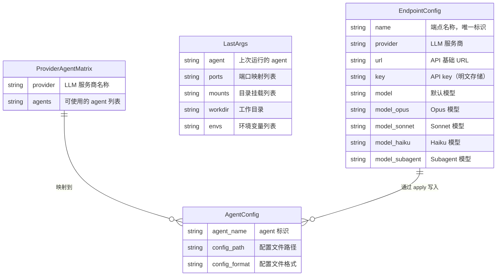

### EndpointConfig（endpoint.env）

每个端点对应 `<config-dir>/endpoints/<端点名称>/` 目录中的 `endpoint.env` 文件。

| 字段 | 类型 | 描述 |
|------|------|------|
| PROVIDER | string | LLM 服务商标识，可选值：`deepseek` / `openai` / `anthropic` |
| URL | string | API 基础 URL，如 `https://api.openai.com` |
| KEY | string | API key，明文存储于宿主机文件系统 |
| MODEL | string | 默认模型名，如 `gpt-4` |
| MODEL_OPUS | string \| 空 | Opus 模型名 |
| MODEL_SONNET | string \| 空 | Sonnet 模型名 |
| MODEL_HAIKU | string \| 空 | Haiku 模型名 |
| MODEL_SUBAGENT | string \| 空 | Subagent 模型名 |

**文件格式：** key=value 键值对，每行一个字段，无引号包裹。
**文件权限：** `0600`（仅文件所有者可读写），遵循 NFR-9。
**CRUD 映射：**
- `endpoint add` → 创建 `<name>/endpoint.env`
- `endpoint set` → 修改 `<name>/endpoint.env` 中指定字段
- `endpoint rm` → 删除 `<name>/` 整个目录
- `endpoint list` → 遍历 `endpoints/` 目录读取各端点
- `endpoint show` → 读取并显示，KEY 字段做掩码处理

### LastArgs（.last_args）

存储在 `<config-dir>/.last_args` 文件。

| 字段 | 类型 | 描述 |
|------|------|------|
| AGENT | string | `-a` 参数值，空表示 bash 模式 |
| PORTS | string | `-p` 参数值，空格分隔多个映射，如 `"3000:3000 8080:8080"` |
| MOUNTS | string | `-m` 参数值，空格分隔多个路径 |
| WORKDIR | string | `-w` 参数值，默认 `.` |
| ENVS | string | `-e` 参数值，空格分隔多个 `KEY=VALUE` |
| MODE | string | 运行模式，`normal` / `docker` / `dind` / `run` |
| RUN_CMD | string \| 空 | `--run` 指定的命令 |
| DIND | boolean | 是否 `--docker` 或 `--dind` 模式 |

**文件格式：** key=value 键值对，每行一个字段。
**写时机：** 每次 `run` 命令执行成功后立即写入（NFR-12）。
**读时机：** `run -r/--recall` 时读取，文件不存在则报错并阻止容器启动（REQ-17）。

### Provider-Agent Matrix（内部映射表）

硬编码在源码中的静态映射关系，定义每个 LLM provider 可服务于哪些 agent：

| Provider | 可服务的 Agent |
|----------|---------------|
| deepseek | claude、opencode、kimi、deepseek-tui |
| openai | claude、opencode |
| anthropic | claude |

**用途：**
- `endpoint providers` 命令从此表读取并输出
- `endpoint apply` 根据端点 provider 查询此表确定写入哪些 agent 配置
- `endpoint status` 反向查询，显示每个 agent 当前关联的端点

### Agent Config Files（apply 目标文件）

`endpoint apply` 将端点配置写入的目标文件，各 agent 格式不同：

| Agent | 配置文件路径 | 格式 | 写入内容 |
|-------|-------------|------|---------|
| claude | `coding-config/.claude/.env` | key=value | `ANTHROPIC_API_KEY`（anthropic）或 `OPENAI_API_KEY`（openai）+ `OPENAI_BASE_URL` |
| opencode | `coding-config/.opencode/.env` | key=value | `OPENAI_API_KEY` + `OPENAI_BASE_URL` 等 |
| kimi | `coding-config/.kimi/config.toml` | TOML | `[api]\nkey = "xxx"\nbase_url = "yyy"` |
| deepseek-tui | `coding-config/.deepseek/.env` | key=value | `DEEPSEEK_API_KEY` + `DEEPSEEK_BASE_URL` |

**权限：** 所有配置文件写入后设置为 `0600`（NFR-9）。
**来源：** 配置父目录由 `-c` 参数或默认值决定，通过 Config Resolver 统一解析。

---

## API / 契约

### CLI 命令规范

所有命令通过单入口脚本路由，遵循统一的参数解析规则。`[name]` 表示可选参数，`<name>` 表示必填参数。

---

### `agent-forge build [options]`
- **描述：** 构建包含指定依赖的 Docker 镜像
- **参数：**
  | 参数 | 类型 | 默认值 | 描述 |
  |------|------|--------|------|
  | `-d <deps>` | string | 必填 | 依赖列表，`+` 分隔元标签（`all`/`mini`），`,` 分隔单体依赖（`claude,golang@1.21,node@18`） |
  | `-b <image>` | string | `docker.1ms.run/centos:7` | 基础镜像 |
  | `-c <dir>` | string | `$(pwd)/coding-config` | 配置父目录 |
  | `--no-cache` | flag | false | 强制跳过 Docker 缓存 |
  | `-R` / `--rebuild` | flag | false | 重建模式，自动叠加 `--no-cache` |
  | `--max-retry <n>` | int | 3 | 网络错误重试次数 |
  | `--gh-proxy <url>` | string | 无 | GitHub 代理 URL（传空值禁用） |
- **退出码：**
  | 退出码 | 条件 |
  |--------|------|
  | 0 | 构建成功 |
  | 1 | 构建失败（依赖安装错误、网络错误超过重试次数） |
  | 2 | 参数无效（`-d` 为空、依赖名称格式错误等） |
- **覆盖的场景：** 构建包含全部依赖的镜像、构建包含指定依赖的自定义镜像、构建过程中网络错误时自动重试、重建镜像成功替换旧标签、重建失败时保留旧镜像

---

### `agent-forge run [options]`（默认命令）
- **描述：** 在容器中启动 AI agent 交互终端或其他运行模式
- **参数：**
  | 参数 | 类型 | 默认值 | 描述 |
  |------|------|--------|------|
  | `-a <agent>` | string | 无 | AI agent 名称（claude / opencode / kimi / deepseek-tui）；不指定则进入 bash 模式 |
  | `-c <dir>` | string | `$(pwd)/coding-config` | 配置父目录 |
  | `-p <host:container>` | string[] | 无 | 端口映射，可多次指定 |
  | `-m <path>` | string[] | 无 | 只读目录挂载（容器内同路径），可多次指定 |
  | `-w <dir>` | string | 当前目录 | 容器内工作目录 |
  | `-e <KEY=VALUE>` | string[] | 无 | 环境变量注入，可多次指定 |
  | `-r` / `--recall` | flag | false | 从 `.last_args` 恢复上次运行参数 |
  | `--docker` / `--dind` | flag | false | Docker-in-Docker 特权模式 |
  | `--run <cmd>` | string | 无 | 后台执行命令后自动退出 |
  | `--gitnexus` | flag | false | 挂载 gitnexus 数据目录 |
  | `--golang` | flag | false | 挂载 GOPATH |
- **退出码：**
  | 退出码 | 条件 |
  |--------|------|
  | 0 | 容器运行正常退出（agent 交互正常结束 / bash 正常退出 / `--run` 命令执行成功） |
  | 1 | 容器运行异常（Docker daemon 错误、容器启动失败） |
  | 对应命令码 | `--run` 模式下容器退出码与所执行命令的退出码一致（REQ-18） |
  | 2 | 参数无效或 `.last_args` 不存在（REQ-17） |
- **覆盖的场景：** 启动指定 agent 带完整配置的交互式终端、不指定 agent 以 bash 模式启动容器、以 Docker-in-Docker 特权模式启动容器、通过 -r 参数恢复上次运行参数启动容器、不存在历史参数时使用 -r 恢复失败、后台执行命令后自动退出容器

---

### `agent-forge endpoint <subcommand> [name] [options]`

**认证：** 所有 endpoint 子命令均无需认证，在宿主机本地执行。

---

#### `endpoint providers`
- **描述：** 列出所有支持的 LLM 服务商及其可服务的 AI agent
- **退出码 0:** 输出服务商列表表格
- **NFR-5:** 1 秒内完成

#### `endpoint list`
- **描述：** 以表格列出所有端点（NAME / PROVIDER / MODEL）
- **退出码 0:** 输出端点表格

#### `endpoint show <name>`
- **描述：** 查看指定端点的详细配置
- **输出掩码：** KEY 字段显示为前 8 字符 + `***` + 后 4 字符（NFR-6，REQ-21）
- **退出码：**
  | 退出码 | 条件 |
  |--------|------|
  | 0 | 端点存在 |
  | 1 | 端点不存在 |

#### `endpoint add <name> [options]`
- **描述：** 新增 LLM 端点
- **参数：**
  | 参数 | 类型 | 描述 |
  |------|------|------|
  | `--provider <name>` | string | LLM 服务商（deepseek / openai / anthropic） |
  | `--url <url>` | string | API 基础 URL |
  | `--key <key>` | string | API key |
  | `--model <name>` | string | 默认模型 |
  | `--model-opus <name>` | string | Opus 模型 |
  | `--model-sonnet <name>` | string | Sonnet 模型 |
  | `--model-haiku <name>` | string | Haiku 模型 |
  | `--model-subagent <name>` | string | Subagent 模型 |
- **交互模式：** 缺少必要参数时，逐一提示缺失项，每项提示包含参数名、格式和可选值（NFR-14，REQ-23）
- **退出码：**
  | 退出码 | 条件 |
  |--------|------|
  | 0 | 创建成功 |
  | 1 | 创建失败（目录写入错误、名称冲突等） |

#### `endpoint set <name> [options]`
- **描述：** 修改已有端点的配置参数
- **参数：** 与 `add` 相同的参数，只需提供要修改的字段
- **退出码：**
  | 退出码 | 条件 |
  |--------|------|
  | 0 | 修改成功 |
  | 1 | 端点不存在或写入失败 |

#### `endpoint rm <name>`
- **描述：** 删除指定端点及其对应目录
- **退出码：**
  | 退出码 | 条件 |
  |--------|------|
  | 0 | 删除成功 |
  | 1 | 端点不存在或删除失败 |

#### `endpoint test <name>`
- **描述：** 测试端点连通性，发送 POST chat/completions 请求
- **行为：** 通过 Go `net/http` 向端点 URL 发送 POST 请求，测量延迟，输出回复摘要
- **超时：** 30 秒（NFR-4）
- **退出码：**
  | 退出码 | 条件 |
  |--------|------|
  | 0 | 端点可达，请求成功 |
  | 1 | 端点不可达、超时、认证失败（NFR-4，REQ-27） |

#### `endpoint apply [name] [options]`
- **描述：** 将端点配置同步到各 agent 配置文件
- **参数：**
  | 参数 | 类型 | 默认值 | 描述 |
  |------|------|--------|------|
  | `[name]` | string | 全部端点 | 指定端点名称 |
  | `--agent <list>` | string | 全部适用 agent | 逗号分隔的 agent 列表 |
- **写入格式：** 按各 agent 指定格式（claude/opencode/deepseek-tui → `.env`，kimi → `config.toml`）
- **文件权限：** `0600`（NFR-9）
- **退出码：**
  | 退出码 | 条件 |
  |--------|------|
  | 0 | 所有目标同步成功 |
  | 1 | 部分或全部写入失败 |

#### `endpoint status [name]`
- **描述：** 查看 agent 与端点的映射关系
- **退出码 0:** 输出 agent 名称和关联端点名称的表格
- **覆盖的场景：** 查看 agent 端点映射关系

---

### `agent-forge doctor`
- **描述：** 执行三层环境诊断并自动修复
- **诊断顺序：**
  1. 核心依赖：docker
  2. 运行时：Docker daemon 运行状态、权限
  3. 可选工具：buildx
- **自动修复：** 核心依赖缺失时使用包管理器安装（NFR-19），安装后重新检测
- **退出码：**
  | 退出码 | 条件 |
  |--------|------|
  | 0 | 全部三层通过 |
  | 1 | 至少一项诊断不通过（自动安装失败或运行时异常） |
- **覆盖的场景：** 环境诊断

---

### `agent-forge deps`
- **描述：** 查询容器内依赖安装状态
- **行为：** 在宿主机生成检测脚本，通过 `docker run --rm` 在临时容器中执行，输出按 agent/skill/tool/runtime 分类
- **退出码：**
  | 退出码 | 条件 |
  |--------|------|
  | 0 | 检测完成 |
  | 1 | Docker 镜像不存在或检测脚本执行失败 |
- **覆盖的场景：** 查询容器内依赖安装状态

---

### `agent-forge export [filename]`
- **描述：** 将 Docker 镜像导出为 tar 文件
- **默认文件名：** `agent-forge.tar`
- **退出码：**
  | 退出码 | 条件 |
  |--------|------|
  | 0 | 导出成功 |
  | 1 | 镜像不存在或 ImageSave API 调用失败 |

---

### `agent-forge import <file>`
- **描述：** 从 tar 文件加载 Docker 镜像
- **退出码：**
  | 退出码 | 条件 |
  |--------|------|
  | 0 | 导入成功 |
  | 1 | 文件不存在或 ImageLoad API 调用失败 |
- **覆盖的场景：** 导出和导入镜像实现离线分发

---

### `agent-forge update`
- **描述：** 从 Git remote 或 UPDATE_URL 下载更新
- **行为：** 下载新版本前备份当前版本，更新失败时自动回滚（NFR-13）
- **退出码：**
  | 退出码 | 条件 |
  |--------|------|
  | 0 | 更新成功 |
  | 1 | 更新失败（已回滚至旧版本） |

---

### `agent-forge version`
- **描述：** 显示版本号和 git hash
- **退出码 0:** 始终为 0
- **NFR-5:** 1 秒内完成

---

### `agent-forge help [command]`
- **描述：** 输出指定命令的帮助信息，无参数时输出全局帮助
- **退出码 0:** 始终为 0
- **NFR-15:** 统一格式：名称 + 用途 + 参数列表（含名称、类型、默认值）+ 使用示例

---

### 通用退出码规范

| 退出码 | 含义 | 适用场景 |
|--------|------|---------|
| 0 | 成功 | 所有命令正常完成 |
| 1 | 通用执行错误 | 构建失败、运行异常、端点 CRUD 失败、诊断不通过、分发失败、更新失败 |
| 2 | 参数错误 | 无效参数、缺少必填参数、参数格式错误 |

### 通用错误信息格式

遵循 NFR-16，所有失败场景的错误信息必须包含：
- **原因：** 失败的具体原因（如"连接超时"、"文件未找到"、"参数无效"）
- **上下文：** 涉及的命令和参数上下文
- **建议：** 修正措施或排查方向

---

## 执行流程

### 流程：构建包含全部依赖的镜像（Scenario: 构建包含全部依赖的镜像）

1. **CLI Router** 接收 `build` 子命令，将控制权交给 BuildEngine
2. **Args Parser** 解析 `-d all --max-retry 3`，提取依赖列表和重试次数
3. **Docker Helper** 检测 Docker 运行状态和 BuildKit 支持
4. **Deps Module** 将 `all` 元标签展开为全部 agent、runtime、tool 的完整安装指令列表
5. **Dockerfile Generator** 生成 Dockerfile：FROM 基础镜像 → 设置国内镜像源 → 安装所有依赖 → 配置环境变量
6. **BuildEngine** 调用 Docker Helper 通过 SDK `ImageBuild` API 执行构建，传入 Dockerfile tar context
7. **Docker Helper** 流式读取构建输出，检测网络错误（NFR-10）
8. **BuildEngine** 构建成功，Docker Helper 通过 `ImageList` API 确认镜像可见
9. **CLI Router** 以退出码 0 退出

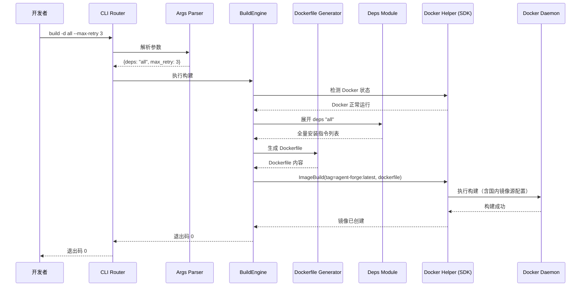

**替代流程：**
- *依赖中包含未知名称（REQ-1）*：Deps Module 将未知名称作为系统包名通过 yum 安装
- *Docker 未运行（NFR-17）*：步骤 3 失败 → CLI 输出 "Docker Engine 未运行" 错误信息，退出码 1

---

### 流程：构建包含指定依赖的自定义镜像（Scenario: 构建包含指定依赖的自定义镜像）

1. **CLI Router** 接收 `build` 子命令，解析 `-d claude,golang@1.21,node@20 -b docker.1ms.run/centos:7 -c /path/to/config`
2. **Deps Module** 识别单体依赖：claude（agent）、golang@1.21（runtime 带版本）、node@20（runtime 带版本）
3. **Dockerfile Generator** 生成 Dockerfile：
   - FROM `docker.1ms.run/centos:7`
   - yum 切换阿里云 CentOS Vault
   - 安装 golang 1.21 指定版本
   - 安装 node 20.x（nvm 或 nodesource）
   - 安装 claude（npm install -g @anthropic-ai/claude-code）
4. **BuildEngine** 通过 SDK `ImageBuild` 执行构建，构建成功后退出码 0

**替代流程：**
- *依赖版本不可用（REQ-1）*：包管理器返回错误 → BuildEngine 输出失败原因 → 退出码 1

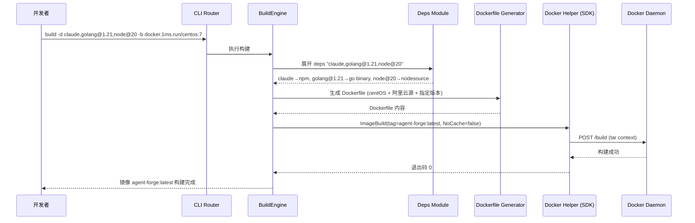

---

### 流程：构建过程中网络错误自动重试（Scenario: 构建过程中网络错误时自动重试）

1. **BuildEngine** 启动构建，调用 Dockerfile Generator 生成 Dockerfile（配置 `--gh-proxy https://gh-proxy.example.com` 代理）
2. **Docker Helper** 执行 `ImageBuild`，首次 GitHub 资源请求超时
3. **Docker Helper** 识别网络错误（HTTP 请求失败，如连接超时/被拒），通知 BuildEngine
4. **BuildEngine** 启动指数退避重试：首次等待 1 秒、第二次等待 2 秒、第三次等待 4 秒（NFR-10）
5. 在第三次重试时资源下载成功，构建继续
6. 构建完成，退出码 0

**替代流程：**
- *超过最大重试次数后仍失败*：BuildEngine 输出 "网络错误超过最大重试次数 N 次，建议检查网络或使用 --gh-proxy"，退出码 1

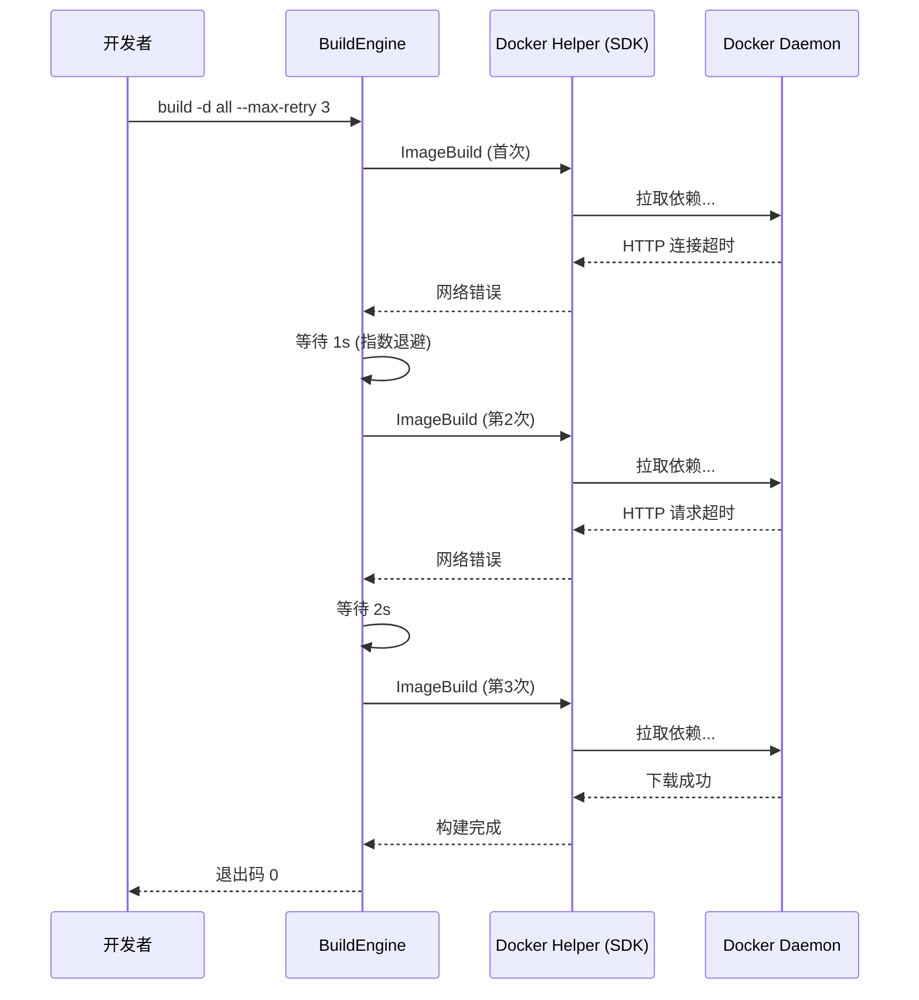

---

### 流程：重建镜像成功替换旧标签（Scenario: 重建镜像成功替换旧标签）

1. **BuildEngine** 识别 `-R/--rebuild` 参数，自动叠加 `--no-cache`（REQ-6）
2. **Dockerfile Generator** 生成使用临时标签 `agent-forge:tmp-<timestamp>` 的 Dockerfile
3. **Docker Helper** 执行 `docker build -t agent-forge:tmp-<timestamp> --no-cache`
4. 构建成功
5. **BuildEngine** 执行原子替换：`ImageTag` 将临时标签指向新镜像 → `ImageRemove` 删除旧镜像 ID（NFR-23）
6. 退出码 0

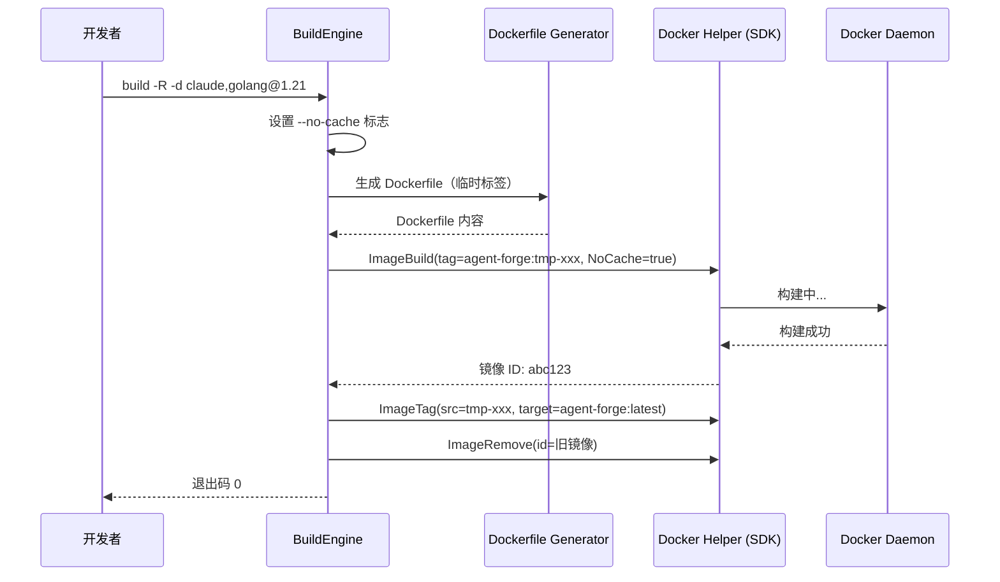

---

### 流程：重建失败时保留旧镜像（Scenario: 重建失败时保留旧镜像）

1. **BuildEngine** 创建临时标签 `agent-forge:tmp-<timestamp>`，启动构建
2. 构建因依赖安装失败（invalid-package-that-fails）
3. **Docker Helper** 返回构建失败状态
4. **BuildEngine** 清理临时镜像：`ImageRemove`(id=agent-forge:tmp-xxx)（NFR-11）
5. 保留原镜像 `agent-forge:latest` 不变
6. 退出码 非零

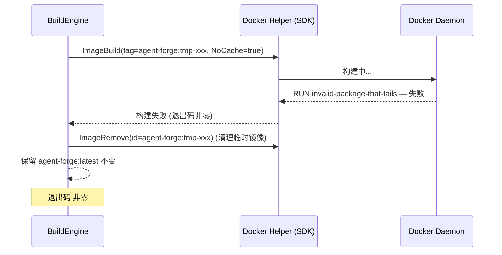

---

### 流程：启动指定 agent 带完整配置的交互式终端（Scenario: 启动指定 agent 带完整配置的交互式终端）

1. **CLI Router** 接收 `run -a claude -p 3000:3000 -m /host/data -w /workspace -e OPENAI_KEY=sk-xxx`
2. **Args Parser** 解析参数：agent=claude, ports=["3000:3000"], mounts=["/host/data"], workdir="/workspace", envs=["OPENAI_KEY=sk-xxx"]
3. **RunEngine** 从 Config Resolver 获取配置目录路径
4. **Docker Helper** 组装 `ContainerCreate` 配置：
   - Image: agent-forge:latest
   - PortBindings: 3000:3000
   - Mounts: /host/data → /host/data（只读，NFR-8）
   - WorkingDir: /workspace
   - Env: OPENAI_KEY=sk-xxx
   - Tty: true, OpenStdin: true
   - Cmd: ["claude"]
5. **Docker Helper** 通过 SDK `ContainerCreate` + `ContainerStart` + `ContainerAttach` 启动容器并连接 IO
6. 容器启动，claude 交互终端可用
7. **Args Persistence** 自动将所有参数保存到 `.last_args`（NFR-12）

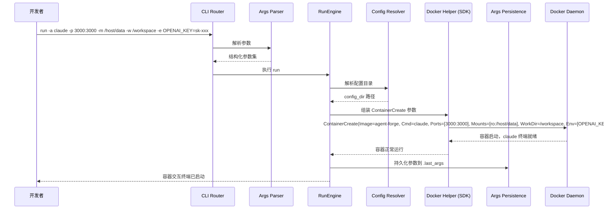

---

### 流程：不指定 agent 以 bash 模式启动容器（Scenario: 不指定 agent 以 bash 模式启动容器）

1. **Args Parser** 解析不到 `-a` 参数，标记为 bash 模式
2. **RunEngine** 从 Wrapper Loader 获取 wrapper 函数脚本内容
3. **Docker Helper** 通过 SDK `ContainerCreate`(Tty=true, OpenStdin=true, Cmd=["bash", "-c", "source wrapper; bash"]) 组装容器配置
4. `ContainerStart` + `ContainerAttach` 启动容器，进入 bash shell，wrapper 函数已加载
5. 开发者在容器内可直接调用 `claude`、`opencode`、`kimi`、`deepseek-tui` 等 wrapper 函数

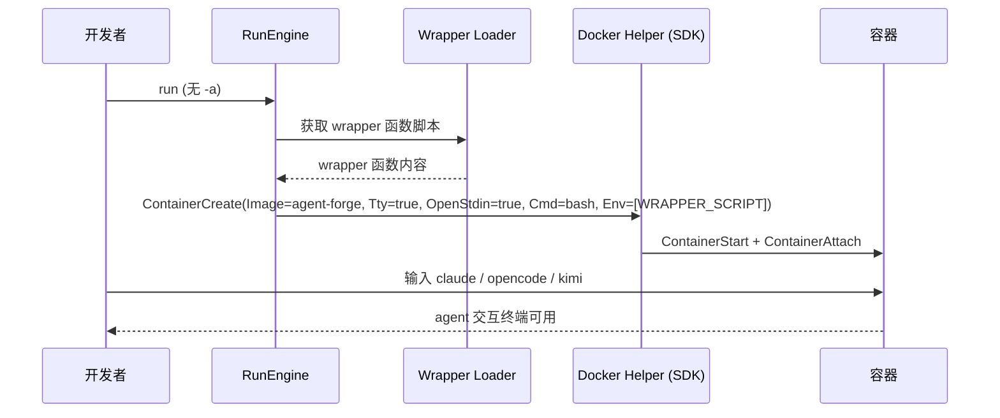

---

### 流程：以 Docker-in-Docker 特权模式启动容器（Scenario: 以 Docker-in-Docker 特权模式启动容器）

1. **Args Parser** 识别 `--docker` 参数
2. **RunEngine** 设置特权模式标志（NFR-7）
3. **Docker Helper** 通过 SDK `ContainerCreate`(Privileged=true, User="root", Mounts=[docker.sock], Cmd=["bash", "-c", "dockerd &; wait"]) 配置特权容器
4. `ContainerStart` + `ContainerAttach` 启动容器，dockerd 自动就绪
5. 开发者可以在容器内执行 `docker ps` 等 docker 命令

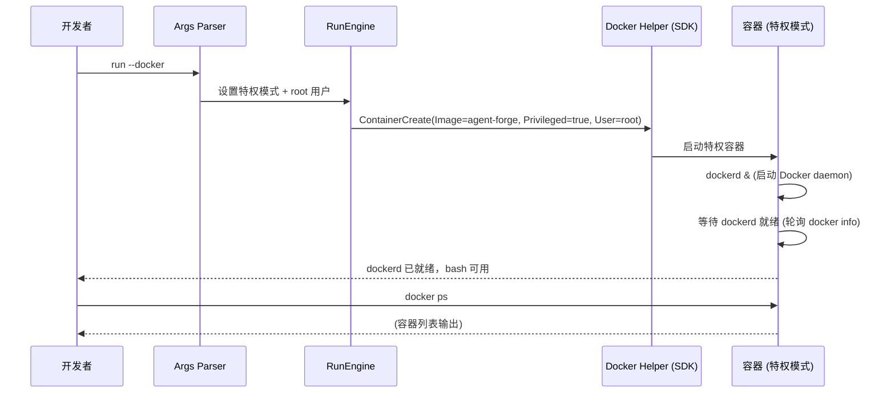

---

### 流程：通过 -r 参数恢复上次运行参数启动容器（Scenario: 通过 -r 参数恢复上次运行参数启动容器）

1. **Args Parser** 识别 `-r` 参数，通知 RunEngine 需从 `.last_args` 恢复
2. **RunEngine** 调用 Args Persistence 读取 `<config-dir>/.last_args`
3. **Args Persistence** 读取文件，解析为结构化参数集
4. **RunEngine** 使用恢复的参数集执行完整的 run 流程（等同于开发者手动输入了这些参数）
5. 容器以与上次运行完全相同的配置启动

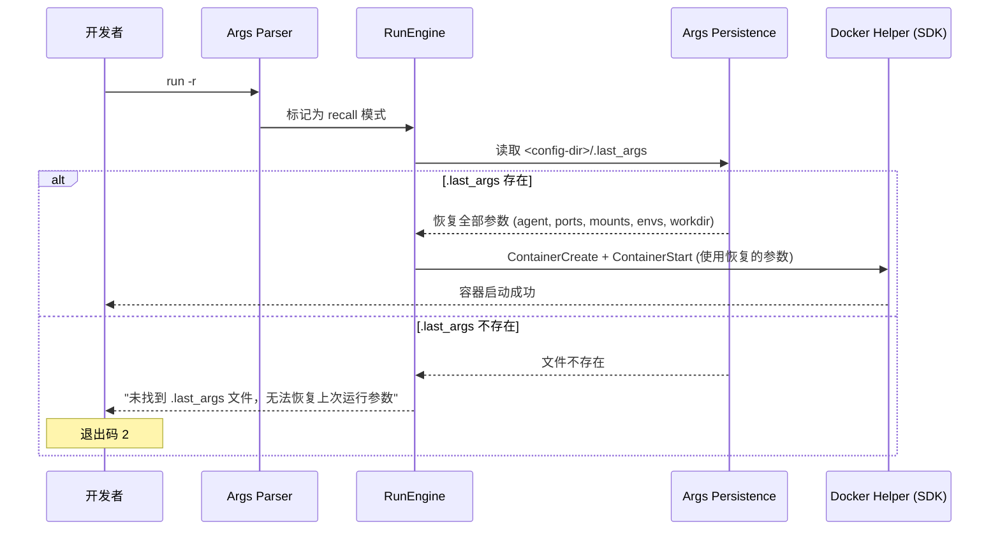

**替代流程（Scenario: 不存在历史参数时使用 -r 恢复失败）：**
- *步骤 2 文件不存在*：Args Persistence 返回文件不存在错误 → RunEngine 输出 "未找到 .last_args 文件，无法恢复上次运行参数" → 容器不启动，退出码 2

---

### 流程：后台执行命令后自动退出容器（Scenario: 后台执行命令后自动退出容器）

1. **Args Parser** 识别 `--run "npm test"` 参数
2. **RunEngine** 设置后台执行模式
3. **Docker Helper** 组装命令：`docker run --rm agent-forge:latest bash -c "npm test"`（无 `-it` 交互标志）
4. Docker Helper 通过 `ContainerCreate`(AutoRemove=true) + `ContainerStart` 后台启动容器
5. 容器执行 `npm test`，完成自动退出（AutoRemove）
6. **Docker Helper** 通过 `ContainerWait` 获取容器退出码，作为 CLI 退出码传递

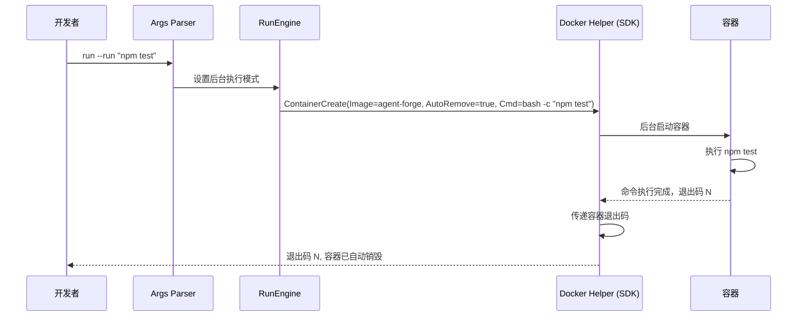

---

### 流程：带全部参数新增 LLM 端点（Scenario: 带全部参数新增 LLM 端点）

1. **CLI Router** 接收 `endpoint add my-ep` 子命令，路由到 EndpointManager
2. **Args Parser** 解析全部 8 个参数（--provider openai --url https://api.openai.com --key sk-test-key-value --model gpt-4 等）
3. **EndpointManager** 在 endpoint 存储目录创建 `endpoints/my-ep/` 目录
4. **EndpointManager** 写入 `endpoints/my-ep/endpoint.env` 文件，权限 `0600`（NFR-9）
5. 创建成功

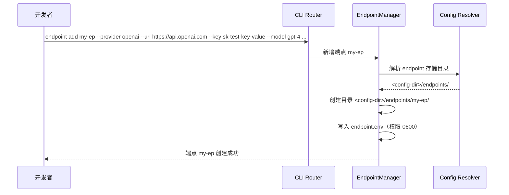

---

### 流程：缺少参数时交互式新增 LLM 端点（Scenario: 缺少参数时交互式新增 LLM 端点）

1. **Args Parser** 检测到 `--provider` 和 `--url` 缺失
2. **EndpointManager** 进入交互模式（NFR-14）
3. 逐一提示：
   - "请输入 provider (可选值: deepseek/openai/anthropic):"
   - "请输入 API URL:"
   - "请输入默认模型（可选，直接回车跳过）:"
4. 开发者依次输入 deepseek、https://api.deepseek.com
5. **EndpointManager** 创建端点并写入配置文件

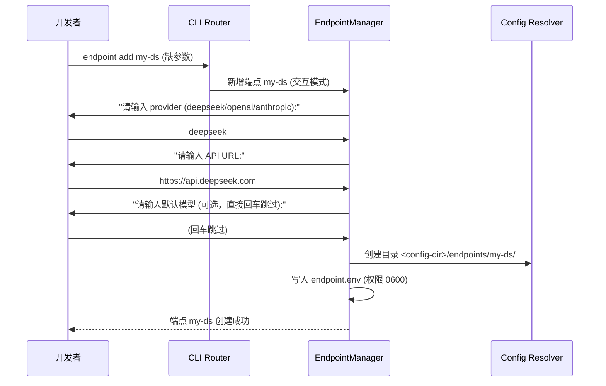

---

### 流程：修改已有端点的配置（Scenario: 修改已有端点的配置）

1. **CLI Router** 接收 `endpoint set my-ep --key sk-new-key --model gpt-5`
2. **EndpointManager** 读取 `<config-dir>/endpoints/my-ep/endpoint.env`
3. **EndpointManager** 更新 KEY 和 MODEL 字段
4. 写回文件，权限 `0600`

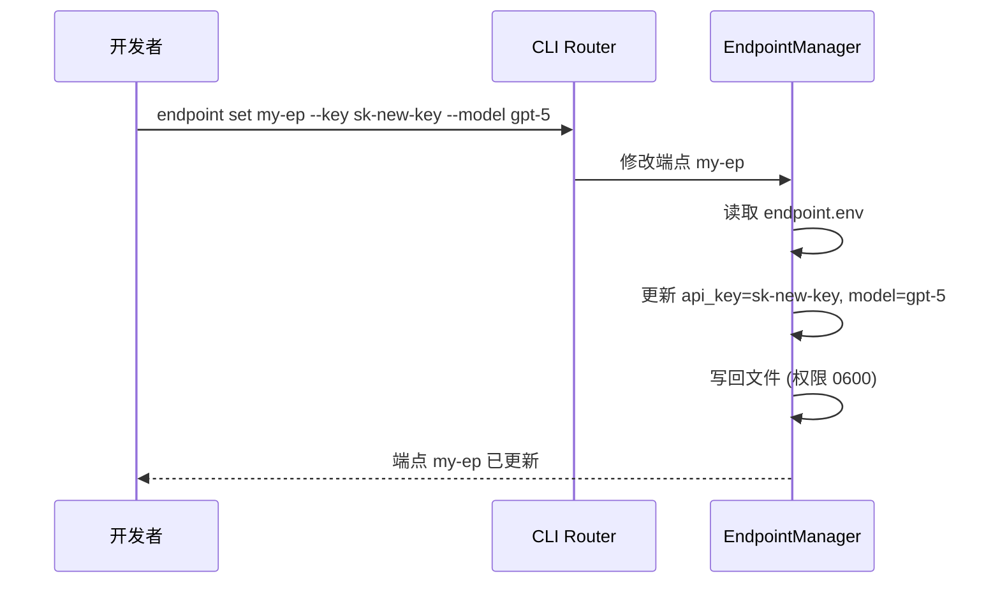

---

### 流程：删除 LLM 端点（Scenario: 删除 LLM 端点）

1. **CLI Router** 接收 `endpoint rm my-ep`
2. **EndpointManager** 递归删除 `<config-dir>/endpoints/my-ep/` 目录

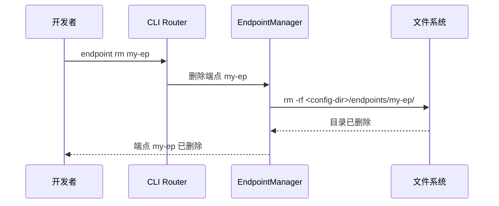

---

### 流程：查看提供商列表和端点详情（Scenario: 查看提供商列表和端点详情）

1. **endpoint providers**：EndpointManager 读取 Provider-Agent Matrix 硬编码映射表，输出服务商与 agent 对照表
2. **endpoint list**：EndpointManager 遍历 `endpoints/` 目录，读取每个端点的 endpoint.env 的 PROVIDER 和 MODEL 字段，以 NAME/PROVIDER/MODEL 表格输出
3. **endpoint show my-ep**：读取 `my-ep/endpoint.env` 全部字段，KEY 字段做掩码处理（NFR-6）：前 8 字符 + `***` + 后 4 字符

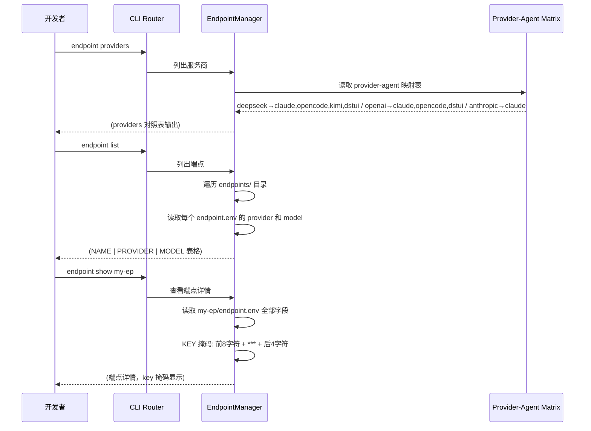

---

### 流程：测试端点连通性成功（Scenario: 测试端点连通性成功）

1. **CLI Router** 接收 `endpoint test my-ep`，路由到 EndpointManager
2. **EndpointManager** 读取 `my-ep/endpoint.env` 获取 URL 和 KEY
3. **EndpointManager** 通过 Go `net/http` 向 `{URL}/chat/completions` 发送 POST 请求
4. 请求成功，测量延迟
5. 输出请求延迟（如 "延迟: 320ms"）和回复摘要
6. 退出码 0

**替代流程（Scenario: 测试端点连通性失败）：**
- *步骤 3 请求超时或失败*：HTTP 请求在 30 秒内超时（NFR-4）→ 输出 "连接失败: 连接超时，建议检查 URL 和网络连通性" → 退出码 1

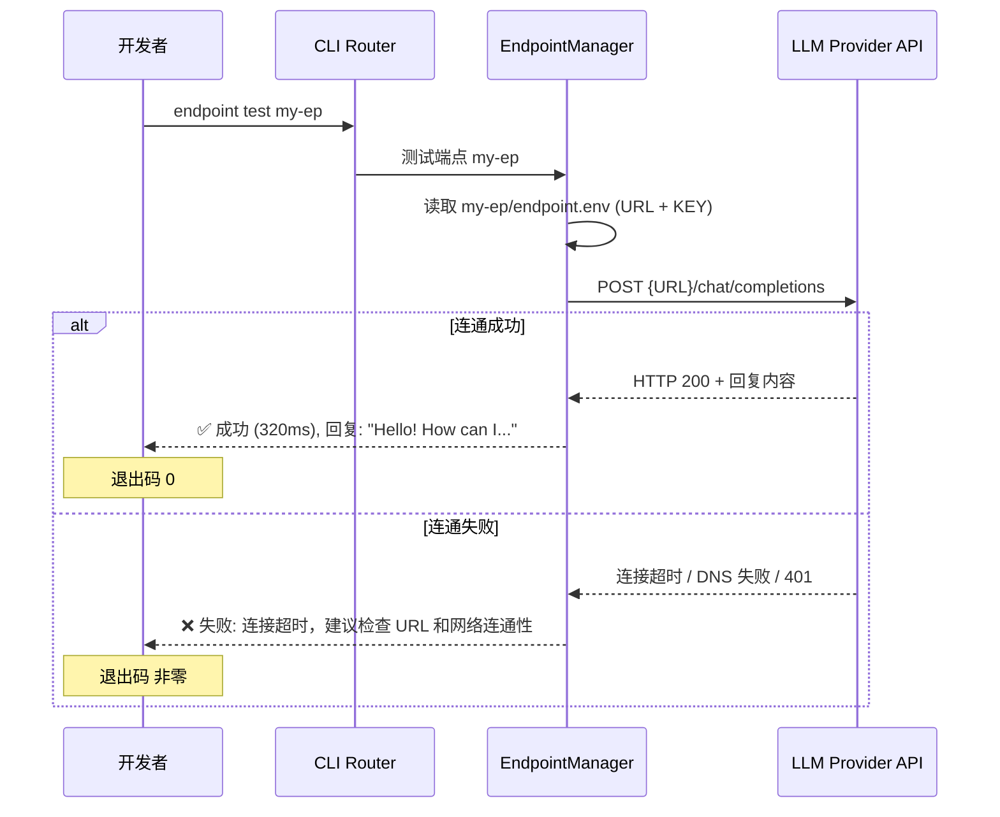

---

### 流程：同步端点配置到 agent（Scenario: 同步端点配置到 agent）

1. **CLI Router** 接收 `endpoint apply my-ep`，路由到 Apply Syncer
2. **Apply Syncer** 读取 `my-ep/endpoint.env` 获取配置
3. **Apply Syncer** 查询 Provider-Agent Matrix，确定该 provider 对应的 agent 列表
4. 对每个适用 agent，按格式写入配置文件：
   - claude：写入 `.claude/.env`，格式 `OPENAI_API_KEY=sk-test-key-value` + `OPENAI_BASE_URL=https://api.openai.com`
   - opencode：写入 `.opencode/.env`
   - kimi：写入 `.kimi/config.toml`，格式 `[api]\nkey = "sk-test-key-value"`
   - deepseek-tui：写入 `.deepseek/.env`
5. 所有文件权限设为 `0600`（NFR-9）

**替代流程（Scenario: 同步端点配置到 agent — 带 --agent 过滤）：**
- *步骤 3 使用 `--agent claude,kimi`*：Apply Syncer 仅写入 claude 和 kimi 的配置文件，opencode 和 deepseek-tui 不受影响

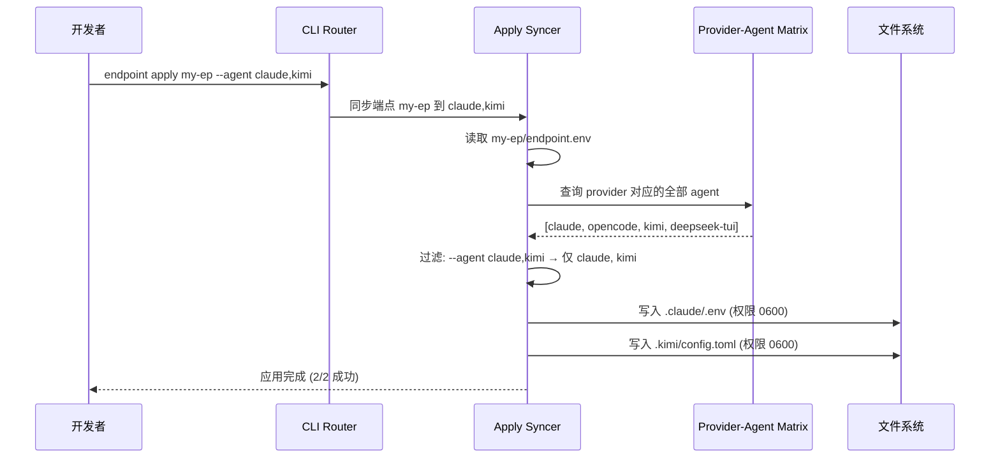

---

### 流程：查看 agent 端点映射关系（Scenario: 查看 agent 端点映射关系）

1. **CLI Router** 接收 `endpoint status`
2. **EndpointManager** 遍历 `endpoints/` 目录，读取每个端点的 PROVIDER
3. 对每个 provider，查询 Provider-Agent Matrix 获取可服务的 agent 列表
4. 输出表格：| Agent | 关联端点 |

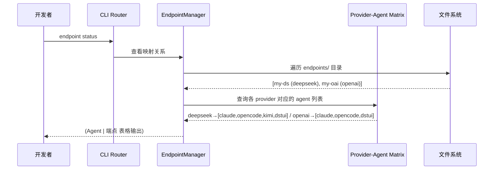

---

### 流程：环境诊断（Scenario: 环境诊断）

1. **CLI Router** 接收 `doctor`，路由到 DiagnosticEngine
2. **第一层 — 核心依赖检测**：通过 Docker SDK 尝试连接 `/var/run/docker.sock` 验证 daemon 可用性（Go 单二进制已消除 docker CLI/curl/git 运行时依赖，直接通过 Unix socket 通信）
3. 如果缺失核心依赖，调用 Package Manager Adapter 自动安装（NFR-19）
4. 安装后重新检测，循环直到全部通过或安装失败
5. **第二层 — 运行时检测**：通过 SDK `Ping` API 检查 Docker daemon 连通性，`Info` API 检查用户权限
6. **第三层 — 可选工具检测**：检查 buildx 安装状态（jq 已由 Go `encoding/json` 替代）
7. 输出每层诊断结果

```mermaid
sequenceDiagram
    participant Dev as 开发者
    participant CLI as CLI Router
    participant DE as DiagnosticEngine
    participant PM as Package Manager Adapter
    participant OS as 操作系统

    Dev->>CLI: doctor
    CLI->>DE: 执行诊断
    DE->>DE: 检测核心依赖（Docker daemon socket 连通性）
    alt 检测到缺失
        DE->>PM: apt-get/dnf/yum/brew install <缺失依赖>
        PM->>OS: 执行安装命令
        OS-->>PM: 安装完成
        PM-->>DE: 安装结果
        DE->>DE: 重新检测
    end
    DE->>DE: 检测 Docker daemon 状态
    DE->>DE: 检测可选工具（buildx）
    DE-->>Dev: 三层诊断结果输出
```

---

### 流程：查询容器内依赖安装状态（Scenario: 查询容器内依赖安装状态）

1. **CLI Router** 接收 `deps`，路由到 Deps Inspector
2. **Deps Inspector** 生成检测脚本（包含按 agent/skill/tool/runtime 分类的 `which` 和 `--version` 检测命令）
3. **Docker Helper** 通过 SDK `ContainerCreate`(AutoRemove=true, Cmd=["bash", "-c", "<检测脚本>"]) + `ContainerStart` 启动临时容器
4. 临时容器执行脚本，输出分类安装状态和版本
5. 检测完成，临时容器自动销毁

```mermaid
sequenceDiagram
    participant Dev as 开发者
    participant CLI as CLI Router
    participant DI as Deps Inspector
    participant DH as Docker Helper (SDK)
    participant Container as 临时容器

    Dev->>CLI: deps
    CLI->>DI: 执行依赖检测
    DI->>DI: 生成检测脚本 (agent/skill/tool/runtime 分类)
    DI->>DH: ContainerCreate(AutoRemove=true, Cmd=bash -c <脚本>)
    DH->>Container: 启动临时容器 (--rm)
    Container->>Container: 执行检测脚本
    Container-->>DH: agent: claude ✓ 1.0.0 / skill: openspec ✓ 2.1.0 / tool: docker ✓ ...
    DH-->>DI: 检测结果
    DI-->>Dev: (分类表格: agent | skill | tool | runtime)
    Note over Container: 容器自动销毁 (--rm)
```

---

### 流程：导出和导入镜像实现离线分发（Scenario: 导出和导入镜像实现离线分发）

1. **export**：CLI Router 路由到 Docker Helper → 通过 SDK `ImageSave` API 获取 tar stream，写入文件
2. **import**：CLI Router 路由到 Docker Helper → 通过 SDK `ImageLoad` API 从 tar reader 加载镜像
3. import 完成后通过 `ImageList` 确认镜像可见，可通过 `run` 正常启动

```mermaid
sequenceDiagram
    participant DevA as 开发者 (有网络)
    participant AF as AgentForge (host A)
    participant DK as Docker Daemon
    participant Transfer as 传输介质 (U盘/内网)
    participant DevB as 开发者 (离线)
    participant AFB as AgentForge (host B)

    DevA->>AF: export agent-forge.tar
    AF->>DK: ImageSave(ref=agent-forge:latest) → tar stream
    DK-->>AF: 导出完成
    AF-->>DevA: agent-forge.tar 已生成
    DevA->>Transfer: 复制 tar 文件
    Transfer->>DevB: tar 文件到达离线机器
    DevB->>AFB: import agent-forge.tar
    AFB->>DK: ImageLoad(tar reader)
    DK-->>AFB: 镜像加载完成
    AFB-->>DevB: 导入完成
    DevB->>AFB: run -a claude
    AFB-->>DevB: (容器正常启动，agent 可用)
```

---

### 流程：工具自更新和版本信息查看（Scenario: 工具自更新和版本信息查看）

1. **update**：Self-Update Engine 备份当前版本 → 从 Git remote 或 UPDATE_URL 下载新版本 → 验证完整性 → 替换二进制文件 → 嵌入新 git hash
2. 更新失败时自动回滚到备份版本（NFR-13）
3. **version**：Version Info 读取嵌入的版本号和 git hash 并格式化输出
4. **help**：Help System 输出指定命令的统一格式帮助信息

```mermaid
sequenceDiagram
    participant Dev as 开发者
    participant CLI as CLI Router
    participant UE as Self-Update Engine
    participant Git as Git Remote
    participant FS as 文件系统

    Dev->>CLI: update
    CLI->>UE: 执行自更新
    UE->>FS: 备份当前二进制
    UE->>Git: HTTP GET 下载最新版本
    Git-->>UE: 新版本二进制
    UE->>UE: 嵌入 git hash、验证完整性
    UE->>FS: 替换旧二进制为新版本
    UE-->>Dev: 更新完成 (v1.2.0, hash: abc1234)
    alt 下载失败
        Git-->>UE: 网络错误
        UE->>FS: 回滚到备份版本
        UE-->>Dev: 更新失败，已回滚
    end

    Dev->>CLI: version
    CLI-->>Dev: agent-forge 1.2.0 (abc1234)

    Dev->>CLI: build --help
    CLI-->>Dev: (build 命令完整帮助信息)
```

---

## 技术决策

### DT-1: Go 单二进制 vs. Bash/Python CLI

- **问题：** 如何组织 AgentForge CLI 工具的实现语言和文件结构
- **替代方案：**
  - (a) Bash 单文件脚本
  - (b) Python 多文件项目（click/argparse + requests）
  - (c) Go 单二进制（cobra + docker SDK）
- **决策：** Go 单二进制（cobra + docker SDK）
- **理由：** AgentForge 的核心逻辑已超过 Bash 可维护阈值（目前 2200+ 行，且持续增长）。Bash 缺少类型系统，错误处理依赖 `set -e` 和 trap 链，在管理 API key、文件路径、JSON 解析等关键操作时缺乏编译期安全保障。Go 的选择理由：（1）`cobra` 提供结构化 CLI 子命令路由、自动生成 help、参数校验，天然匹配 AgentForge 的 10 个命令 + endpoint 9 个子命令体系；（2）`docker/docker` client SDK 提供类型安全的 Docker API 调用，替代 Bash 中的字符串拼接 `docker run` 命令；（3）单静态二进制分发 — `go build` 产出无外部依赖的可执行文件，无需宿主机的 curl/git/jq；（4）强类型和显式错误返回确保端点配置写入、构建参数校验等关键路径的安全性；（5）`embed` 可将 Dockerfile 模板编译进二进制，消除运行时文件生成。与 Python 相比，Go 避免了虚拟环境、pip 依赖和 CPython 运行时兼容问题。
- **相关需求：** NFR-5（Go 二进制启动 < 10ms，无解释器延迟）、NFR-6~NFR-9（类型安全强化 API key 处理）、NFR-17~NFR-20（单二进制消除宿主依赖）

### DT-2: Docker 作为容器运行时 vs. Podman / containerd

- **问题：** 选择哪个容器运行时作为基础设施依赖
- **替代方案：**
  - (a) Docker Engine（docker CLI）
  - (b) Podman（podman CLI，daemonless 架构）
  - (c) nerdctl + containerd
- **决策：** Docker Engine（版本 >= 20.10）
- **理由：** Docker 是最广泛安装的容器运行时，开发者环境中几乎默认存在。通过 Docker SDK（`/var/run/docker.sock`）直接与 daemon 通信，无需 docker CLI，降低宿主机依赖。Podman 的 daemonless 架构虽然更安全，但其 API 兼容层的 build 和 save/load 行为与 Docker Engine 不完全一致（NFR-17），换 Podman 需要适配层。Trade-off：Docker 需要运行 dockerd 守护进程（daemon），但通过 SDK 直连 socket 无需 CLI 安装，`doctor` 仅检测 socket 连通性即可。
- **相关需求：** NFR-17（Docker Engine >= 20.10 兼容性）

### DT-3: env 文件存储配置 vs. TOML/YAML vs. SQLite

- **问题：** LLM 端点和应用配置应以何种格式持久化
- **替代方案：**
  - (a) `KEY=VALUE` 格式的 `.env` 文件
  - (b) TOML 或 YAML 配置文件
  - (c) SQLite 嵌入式数据库
- **决策：** 使用 `KEY=VALUE` 格式的 `.env` 文件
- **理由：** `.env` 文件是扁平的 key-value 映射，与端点配置的数据结构天然匹配（无嵌套对象或数组）。Go 标准库的 `bufio.Scanner` 可高效完成逐行读写，无需引入 TOML/YAML 解析库或 SQLite CGO 依赖。`.env` 格式的人类可读性优于二进制格式，开发者可用任意文本编辑器直接修改。与 TOML/YAML 相比，`.env` 文件在容器生态中广泛使用（docker --env-file、docker-compose），与 AgentForge 的容器化定位一致。
- **相关需求：** REQ-22（endpoint add）、NFR-9（文件权限 0600）

### DT-4: 动态 Dockerfile 生成 vs. 固定多阶段 Dockerfile vs. docker commit

- **问题：** 如何根据 `-d` 参数动态构建包含指定依赖的镜像
- **替代方案：**
  - (a) 动态生成 Dockerfile 内容，通过 `docker build -f-` 管道传入
  - (b) 预定义多阶段 Dockerfile，通过 build args 选择依赖
  - (c) 启动基础容器 → 手动安装依赖 → `docker commit`
- **决策：** 动态 Dockerfile 生成（方案 a）
- **理由：** Dockerfile 的每一行 RUN 指令都会产生一个缓存层，方案 a 根据用户选择的依赖列表精确生成最小层数，充分利用 Docker 缓存（未改变的步骤复用缓存层）。方案 b（多阶段 + build args）需要枚举所有可能的依赖组合，难以支持版本号参数（如 `golang@1.21` vs `golang@1.22`）。方案 c（commit）不可重复构建，违反基础设施即代码原则。Trade-off：需维护 Dockerfile 模板逻辑，但缓存效率和灵活性最优。
- **相关需求：** REQ-1、REQ-2（-d 和 -b 参数）；NFR-1（15 分钟构建完成）、NFR-2（mini 镜像小于 all 的 60%）

### DT-5: 应用层指数退避重试 vs. Docker BuildKit 内置重试

- **问题：** 构建过程中网络错误时如何实现重试
- **替代方案：**
  - (a) 在应用层用循环包装 `docker build` 调用，检测构建输出的网络错误特征
  - (b) 依赖 Docker BuildKit 的 `--retry` 参数
  - (c) 不在应用层重试，仅在构建失败时提示用户手动重试
- **决策：** 方案 a — 应用层循环重试，配合指数退避
- **理由：** BuildKit 的 `--retry`（实际是 `BUILDKIT_RETRY_DOWNLOAD`）只重试单个下载步骤，但 Docker build 的整个 RUN 层可能因 yum install 中途网络中断而整体失败。在应用层重试整个构建可以捕获所有错误。Trade-off：重试整个构建比单步重试耗时更长，但 NFR-10 的指数退避策略确保等待时间可控（1s, 2s, 4s...），且 `--max-retry` 可限制总等待时间。
- **相关需求：** REQ-4、NFR-10（指数退避策略，默认 3 次重试）

### DT-6: .last_args 文件持久化 vs. Docker 容器 label vs. shell 历史

- **问题：** 如何持久化和恢复上次 `run` 命令的全部参数
- **替代方案：**
  - (a) 在 `<config-dir>/.last_args` 文件中以 key=value 格式持久化
  - (b) 在创建的 Docker 容器上设置 label，通过 `docker inspect` 读取
  - (c) 利用 bash `history` 或 `fc` 命令读取历史命令重新解析
- **决策：** 方案 a — `.last_args` 文件
- **理由：** 容器 label 只能关联正在运行的容器，容器停止或被删除后标签丢失；shell 历史易被覆盖、截断且格式复杂难解析。文件持久化在配置目录中，与用户其他配置文件共存，可追踪可编辑。Trade-off：多一个文件在磁盘上占用极小空间，但获得明确的可持久化和可编辑语义。
- **相关需求：** REQ-16、REQ-17；NFR-12（每次 run 后自动持久化）

### DT-7: 临时标签 + 原子替换 vs. 直接覆盖 + 回滚

- **问题：** `-R/--rebuild` 模式下如何安全替换镜像标签
- **替代方案：**
  - (a) 使用临时标签构建（`tmp-<timestamp>`）→ 构建成功后执行 tag 切换和旧镜像删除
  - (b) 直接使用 `docker build -t agent-forge:latest` 覆盖，失败时重新拉取旧版本
  - (c) 每次 rebuild 生成新版本标签（如 `latest-N`），手动切换
- **决策：** 方案 a — 临时标签 + 原子替换
- **理由：** 直接覆盖（b）在构建过程中旧镜像已被替换，如果构建失败中间状态不可恢复。版本标签（c）导致标签膨胀。临时标签方案在构建期间互不影响 — 构建过程中 `agent-forge:latest` 仍指向旧镜像，仅当构建成功后才切换。Trade-off：多了临时标签的创建和删除操作，但 NFR-11 和 NFR-23 要求构建失败时保证旧镜像不受影响，以及无残留镜像，这需要临时标签的显式生命周期管理。
- **相关需求：** REQ-7、REQ-8；NFR-11、NFR-23

### DT-8: 按 agent 格式分别写入 vs. 统一中间格式 + 翻译层

- **问题：** `endpoint apply` 如何适配不同 agent 的配置文件格式
- **替代方案：**
  - (a) Apply Syncer 为每个 agent 类型实现独立的写入逻辑（claude→`.env`，opencode→`.env`，kimi→`config.toml`，deepseek-tui→`.env`）
  - (b) 定义统一的中间配置格式 → 每个 agent 提供译码器转换为目标格式
  - (c) 要求所有 agent 使用同一种配置文件格式
- **决策：** 方案 a — per-agent 独立写入逻辑
- **理由：** 支持的 agent 数量固定（4 个），写入格式差异明确（3 个 agent 用 `.env`、1 个用 TOML），增加翻译层引入额外的复杂度。方案 b 需定义中间 schema 和维护 4 个转换器，人为增加了维护成本。方案 c 不现实 — agent 的配置格式由各自项目决定，AgentForge 无权改变。Trade-off：新增 agent 时需手动编写写入逻辑，但当前范围（4 个 agent）下开销可忽略。
- **相关需求：** REQ-28、REQ-29（endpoint apply 写入多格式目标）

