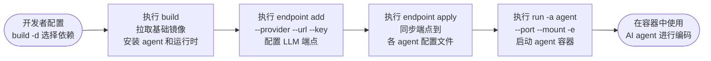
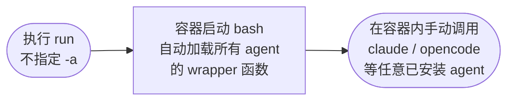
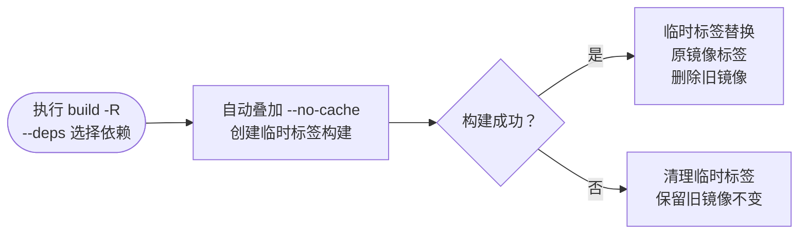
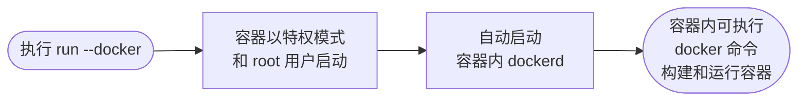
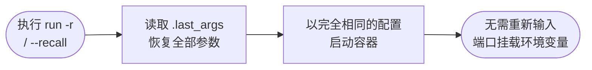
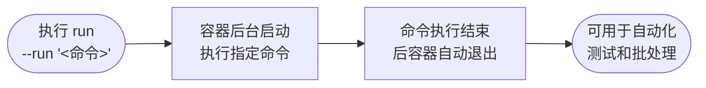
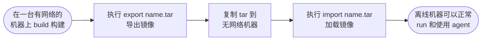
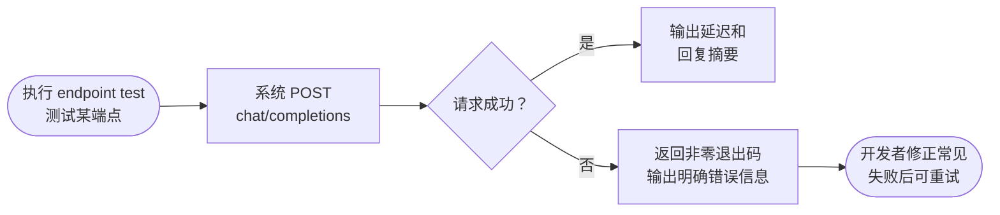
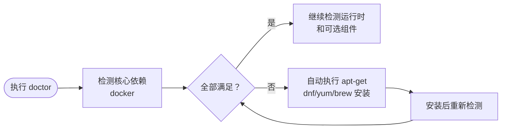

# PRD — AgentForge

## 概述

AgentForge 为开发者提供一个统一的 CLI 工具，通过 Docker 容器化技术一键构建、运行和管理多种 AI coding agent（Claude Code、OpenCode、Kimi、DeepSeek-TUI）及其运行时环境。CLI 涵盖镜像构建（`build`）、容器运行（`run`）、LLM 端点管理（`endpoint` 含 9 个子命令）、环境诊断（`doctor`）、依赖查询（`deps`）、离线分发（`export`/`import`）和自更新（`update`）等完整生命周期，所有操作通过参数化命令控制。

---

## 问题

开发者在使用 AI coding agent 时面临碎片化的安装和管理体验。每种 agent 依赖不同的运行时环境（Node.js、Python、Go），配置文件分散在多个目录，API key 和 LLM 端点需要为每个 agent 分别配置且格式各异。切换机器或加入新项目时，必须重复完成全套安装、配置和调试流程，耗时且易出错。以 Claude Code 和 OpenCode 为例，两者都需要 Node.js 但版本要求不同，Kimi 依赖 Python 而 DeepSeek-TUI 是 Go 二进制，直接在宿主机共存安装经常引发版本冲突和环境污染。

容器化环境的缺失使问题更加突出。不同项目可能依赖不同版本的 agent 和运行时，宿主机上积累大量全局安装包难以清理。在受限网络环境（如内网开发机、离线机房）中安装 agent 依赖时经常因网络不可用而失败，且缺乏有效的离线分发手段——无法将配置好的环境直接带到另一台机器上复用。

团队协作场景下，成员间的 agent 配置难以统一。LLM 端点的服务商、模型选择和 API key 各自维护，一个人使用 Azure OpenAI、另一个人使用 DeepSeek，配置方式截然不同。API key 散落在多个 `.env` 文件和配置目录中，缺乏统一的 CRUD 管理和安全审计能力。这些问题共同阻碍了 AI coding agent 在日常开发流程中的广泛采用。

---

## 目标用户

已安装 Docker Engine 的个人软件开发者或小团队，希望在编码工作流中集成 AI coding agent 但不愿逐个安装、配置和维护多种 agent 及其运行时依赖，同时也需要在受限或离线网络环境中进行环境分发和部署。

---

## 目标

1. 允许开发者通过 `build -d`（支持 `+` 分隔的元标签 `all`/`mini` 和单体依赖如 `claude`、`kimi`、`golang@1.21`、`node@18`、`opencode`、`deepseek-tui`、`speckit`、`openspec`、`gitnexus`、`docker`、`rtk`、`kld-sdd/tr-sdd`，未知名称自动作为系统包安装）灵活选择要安装的 agent、runtime 和工具
2. 支持通过 `build -c` 指定自定义配置父目录、`-b` 指定基础镜像（默认 `docker.1ms.run/centos:7`）、`--no-cache` 强制跳过缓存、`-R/--rebuild` 以临时标签重建并自动叠加 `--no-cache`、`--max-retry` 控制网络错误重试次数（默认 3 次）、`--gh-proxy` 指定 GitHub 代理 URL（传空值禁用）
3. 构建过程中自动使用国内镜像源加速（npm 映射 npmmirror、pip 映射 aliyun、yum 映射 aliyun centos vault），检测 BuildKit 支持，网络错误按指数退避策略重试
4. 提供 `run`（默认命令）通过 `-a` 指定 AI agent（claude / opencode / kimi / deepseek-tui）启动交互式终端；不指定 `-a` 时进入 bash 并加载多 agent wrapper 函数
5. 支持通过 `run -c` 指定配置父目录（默认 `$(pwd)/coding-config`）、`-p` 多次指定端口映射、`-m` 多次指定只读目录挂载（容器内同路径）、`-w` 指定工作目录（默认当前目录）、`-e KEY=VALUE` 多次注入环境变量
6. 支持 `run` 的四种启动模式：指定 agent 交互终端、bash + wrapper 函数、`--docker/--dind` 特权模式启动容器内 Docker（自动启动 dockerd）、`--run <cmd>` 后台执行命令后退出
7. 支持通过 `run -r/--recall` 从 `.last_args` 恢复上次运行的全部参数，`--gitnexus` 挂载 gitnexus 数据目录，`--golang` 挂载 GOPATH；每次运行后自动持久化参数
8. 提供 `endpoint` 的 9 个子命令：`providers` 列出支持的服务商及对应 agent；`list` 以 NAME/PROVIDER/MODEL 表格列出所有端点；`show <name>` 查看详情（key 掩码为前 8 字符 + `***` + 后 4 字符）
9. 支持 `endpoint add <name>` 新增端点，支持 8 个配置选项（`--provider` deepseek/openai/anthropic、`--url`、`--key`、`--model`、`--model-opus`、`--model-sonnet`、`--model-haiku`、`--model-subagent`），缺参时交互式逐个提问并可选拉取模型列表
10. 支持 `endpoint set <name>` 修改端点、`endpoint rm <name>` 删除端点及目录；`endpoint test <name>` 通过 POST chat/completions 测试连通性，显示延迟和回复摘要
11. 支持 `endpoint apply [name]`（可选指定端点，默认全部）将端点配置同步到各 agent 配置文件（claude 写入 `.claude/.env`、opencode 写入 `.opencode/.env`、kimi 写入 `.kimi/config.toml`、deepseek-tui 写入 `.deepseek/.env`），支持 `--agent a,b,c` 逗号分隔筛选目标 agent；`endpoint status [name]` 查看 agent-端点映射关系
12. 提供 `deps` 命令在宿主机执行，自动生成检测脚本并通过 `docker run --rm` 在目标镜像的临时容器中执行检测，回显分类输出 agent/skill/tool/runtime 的安装状态和版本号
13. 提供 `doctor` 命令执行三层环境诊断：核心依赖（docker）→ 运行时（docker daemon 运行状态、权限）→ 可选工具（buildx），并使用 apt-get/dnf/yum/brew 自动安装缺失的核心依赖。JSON 解析（模型列表拉取）通过 Go `encoding/json` 标准库实现，无需 jq。
14. 提供 `export [文件名]`（默认 `dockercoding.tar`）将 Docker 镜像导出为 tar 文件；提供 `import <文件>` 从 tar 文件加载镜像
15. 提供 `update` 从 Git remote 或 UPDATE_URL 下载更新，嵌入 git hash；提供 `version` 显示版本号和 git hash
16. 为每个命令和子命令提供 `help` 帮助信息

---

## 成功标准

| 标准 | 度量 |
| --- | --- |
| 使用 `build -d all --max-retry 3 --gh-proxy https://gh-proxy.org/` 构建镜像成功 | 退出码为 0，`docker images` 可查看到新生成的镜像 |
| 使用 `build -d mini --no-cache` 构建最小依赖镜像 | 退出码为 0，镜像体积小于 `all` 构建的镜像 |
| 使用 `build -R -d claude,golang@1.21 --base docker.1ms.run/centos:7` 重建镜像 | 旧镜像标签被新镜像替换，容器内 `go version` 输出 1.21.x |
| 使用 `build -d kimi,node@20 -b docker.1ms.run/centos:7` 构建指定版本运行时 | 容器内 `node --version` 输出 20.x，kimi CLI 可调用 |
| 使用 `run -a claude -p 3000:3000 -m /host/data -w /workspace -e OPENAI_KEY=sk-xxx` 启动 agent | claude 交互终端启动，容器内端口 3000 可访问、`/host/data` 目录存在、环境变量 `OPENAI_KEY` 生效、工作目录为 `/workspace` |
| 使用 `run -r` 恢复上次参数启动容器 | 容器启动所用参数与上一次 `run` 完全一致 |
| 使用 `run --docker` 启动容器内 Docker | 容器内 `docker ps` 正常运行，dockerd 自动启动 |
| 使用 `run --run 'npm test'` 后台执行单元测试 | 命令在容器内执行，执行完成后容器退出 |
| 不指定 `-a` 执行 `run` 进入 bash | 容器内 bash 启动，可手动调用 claude、opencode、kimi 等 wrapper 函数 |
| `endpoint add my-ep --provider openai --url https://api.openai.com --key sk-test --model gpt-4 --model-opus gpt-4-32k` 新增端点 | `endpoint list` 表格中包含 `my-ep`，`endpoint show my-ep` 显示 key 为 `sk-test***xxxx` 掩码格式 |
| `endpoint test my-ep` 测试一个不可达端点 | 返回非零退出码，输出含连接失败或超时错误信息 |
| `endpoint apply --agent claude,kimi` 将端点同步到指定 agent | claude 的 `.claude/.env` 和 kimi 的 `.kimi/config.toml` 中包含正确的 endpoint 配置 |
| `endpoint status` 查看全部映射关系 | 输出表格包含每个 agent 当前关联的端点名称 |
| `doctor` 检测到缺失依赖后自动安装 | 缺失的 docker 等核心依赖被安装成功，重新 `doctor` 全部通过 |
| `deps` 在宿主机执行，自动生成脚本注入临时容器检测 | 输出分类显示 agent/skill/tool/runtime 的安装状态和版本号，容器检测完成后自动销毁 |
| `export custom-img.tar` 导出镜像后在无网络环境执行 `import custom-img.tar` | 加载成功，`docker images` 显示镜像，`run -a claude` 正常启动容器 |
| `update` 在有新版本时执行 | 工具版本号和 git hash 更新，旧 hash 被替代 |
| `version` 执行 | 输出格式化的版本号和 git hash |
| `build -d unknown-pkg` 构建后，容器内该命令可执行 | 构建退出码为 0，容器内 `which unknown-pkg` 返回路径 |
| `help` 查看各子命令帮助 | 每个命令和子命令输出格式一致的帮助文本 |

---

## 不在范围内

- 图形用户界面（GUI）或 Web 管理面板 — 所有操作通过 CLI 命令和参数完成
- 对 Windows 容器或 ARM（aarch64）架构的原生支持 — 构建和运行针对 Linux x86_64 架构
- 公共镜像市场或预构建镜像仓库的托管和分发 — 镜像由用户在本地构建和管理
- IDE 插件集成（VS Code、JetBrains）— 不提供编辑器端的 UI 操作入口
- 多容器编排、Docker Compose、Docker Swarm 或 Kubernetes 集成 — 面向单容器使用场景
- 多用户权限管理和团队共享的远程配置中心 — 配置本地化存储，面向个人开发者
- LLM 模型的本地部署或自托管推理（如 ollama、llama.cpp、vLLM）— AgentForge 仅管理远端 LLM 端点
- 容器内 GPU 加速支持（CUDA、ROCm、DirectML）— 不处理 GPU 设备透传
- CI/CD 流水线原生集成（GitHub Actions、GitLab CI、Jenkins plugin）— 不提供 CI 系统的 plugin
- 历史对话持久化存储和多会话管理 — agent 的对话历史由各 agent 自行管理，AgentForge 不介入

---

## 主流程

---

## 替代流程

### 无特定 agent — bash 模式

### 重建模式 — rebuild

### Docker-in-Docker 模式

### 恢复上次运行参数

### 后台执行模式

### 离线分发

### 端点测试失败

### 缺失依赖自动修复

---

## 依赖

- **Docker Engine**（版本 >= 20.10）— 所有容器化操作的基础，`build`、`run`、`export`、`import` 命令均依赖 Docker daemon 运行，也是 `doctor` 唯一需要检测的核心依赖（Go 单二进制已消除对 curl、git 等外部工具的运行时依赖）
- **构建好的 Docker 镜像** — `run`、`deps` 命令依赖 `build` 先成功执行生成镜像
- **Git 仓库远程 URL 或 UPDATE_URL** — `update` 命令需要能够从这里下载新版本二进制；git hash 通过编译期 `-ldflags` 嵌入，运行时无需 git 命令
- **LLM provider API 网络的通性** — `endpoint test` 需要能够连接到对应 provider 的 API 地址，HTTP 请求通过 Go `net/http` 标准库完成，无需 curl
- **Linux x86_64 内核兼容性** — 基础镜像和 agent 二进制文件均为 linux-amd64 架构，宿主内核需支持容器运行时所需的 cgroup、namespace 等特性
- **BuildKit 支持** — `build` 命令检测 `DOCKER_BUILDKIT` 环境变量以启用 BuildKit 构建加速（可选，传统构建模式仍可用）

---

## 风险

| 风险 | 缓解措施 |
| --- | --- |
| API key 在宿主机和容器配置文件中明文存储，可能泄露 | `endpoint show` 默认掩码显示密钥（前8+`***`+后4）；配置文件位于用户私有目录，非共享目录；`--key` 参数可在交互模式中隐蔽输入 |
| 构建过程中网络不稳定或镜像源不可用导致构建失败 | `--max-retry` 控制重试次数（默认 3 次），内部按指数退避等待；`--gh-proxy` 支持自定义或禁用 GitHub 代理；采用国内镜像源（npm、pip、yum）替代官方源 |
| Docker 镜像体积过大，占用大量磁盘空间 | 依赖采用模块化选择机制：`-d mini` 仅包含常用子集，`-d` 的单体语法精确控制安装内容，避免无关依赖；基础镜像可通过 `-b` 切换为更精简的发行版 |
| 容器特权模式（`--docker/--dind`）可能带来安全风险 | `--docker/--dind` 为显式参数，不会自动启用；默认 `run` 以非特权模式启动；仅在开发者明确需要容器内 Docker 功能时授予特权 |
| Docker Engine 版本过旧或缺少 BuildKit 支持导致构建行为异常 | `doctor` 检测 `docker version` 和 `DOCKER_BUILDKIT` 环境变量；构建过程中检测 BuildKit 支持状态并给出提示 |
| 容器内挂载的宿主机目录被意外修改或删除 | 默认 `run -m` 挂载为只读（`:ro`），容器内进程无法修改宿主机文件；开发者如需读写挂载可通过其他手段自行实现 |
| `update` 自更新失败导致 CLI 工具损坏或版本回退无门 | 更新前保留旧版本的备份；嵌入 git hash 可追溯；支持从 Git remote 重新克隆恢复 |
| 不同 agent 对 LLM 端点格式的期望不一致导致 `apply` 同步后配置不生效 | `endpoint apply` 按各 agent 的配置文件格式分别写入（`.env` vs `config.toml`）；`endpoint status` 可验证映射关系；`endpoint test` 可独立验证端点连通性 |
