# Tasks — AgentForge

## REQ-1~REQ-8 — 镜像构建 (Image Build)

> **REQ-1**: 当开发者执行 build 命令并通过 `-d` 参数指定依赖列表时，系统必须构建包含所列 AI agent、runtime 和 tool 的 Docker 镜像。
> **REQ-2**: 当开发者通过 `-b` 参数指定基础镜像、通过 `-c` 参数指定配置目录时，系统必须在构建过程中使用指定的基础镜像和配置父目录。
> **REQ-3**: 当系统正在构建 Docker 镜像时，系统必须自动使用国内镜像源（npm 切换为 npmmirror，pip 切换为阿里云，yum 切换为阿里云 centos vault）以加速依赖下载。
> **REQ-4**: 如果在构建过程中发生网络错误，系统必须自动使用指数退避策略重试，重试次数不超过 `--max-retry` 指定的值（默认为 3 次）。
> **REQ-5**: 当开发者通过 `--gh-proxy` 参数指定 GitHub 代理 URL 时，系统必须在构建过程中使用该代理下载资源。
> **REQ-6**: 当开发者向 build 命令传递 `--no-cache` 参数时，系统必须在镜像构建过程中强制跳过 Docker 缓存。
> **REQ-7**: 当开发者执行 build 命令并附带 `-R/--rebuild` 参数时，系统必须使用临时标签构建镜像，构建成功后使用新镜像替换原标签并删除旧镜像，以退出码 0 退出。
> **REQ-8**: 如果重建过程失败，系统必须清理临时标签，保留原镜像不变，并以非零退出码退出。

### T-01: 搭建 Go 项目骨架和 cobra 命令树

- [x] 初始化 Go module，引入 cobra 和 Docker SDK 依赖；搭建命令树骨架，注册 build、run、endpoint、doctor、deps、export、import、update、version 和 help 一级子命令；配置编译期 `-ldflags` 嵌入 git hash；设定 run 为默认子命令。

**可追溯性:** REQ-37 · NFR-22
**依赖:** —
**完成标准:** `agent-forge --help` 输出包含所有 10 个一级子命令列表，`agent-forge version` 输出格式化的版本号和 git hash。

---

### T-02: 实现 Config Resolver 配置路径解析

- [x] 实现 Config Resolver 组件：基于 `-c` 参数或默认值解析配置父目录路径；基于配置父目录导出 endpoint 存储路径（`<config-dir>/endpoints/`）、agent 配置路径等；支持相对路径到绝对路径的转换。

**可追溯性:** REQ-2 · REQ-11 · REQ-13
**依赖:** T-01
**完成标准:** 未指定 `-c` 时返回 `$(pwd)/coding-config`；指定 `-c /path/to/config` 时返回 `/path/to/config`；相对路径被正确解析为绝对路径。

---

### T-03: 实现 Args Parser 命令行参数解析器

- [x] 实现 Args Parser 组件：统一解析 build 和 run 命令的命名参数，支持短参/长参别名（`-r`/`--recall`、`-R`/`--rebuild`）；支持多次出现的参数（如 `-p 3000:3000 -p 8080:8080`）；为所有可选参数设定合理的默认值。

**可追溯性:** 所有涉及 CLI 参数的 REQ
**依赖:** T-01
**完成标准:** `-a claude -p 3000:3000 -p 8080:8080 -m /data -e KEY=VAL -w /work` 正确解析为结构化参数集；`-r` 等价于 `--recall`，`-R` 等价于 `--rebuild`。

---

### T-04: 实现 Docker Helper SDK 基础封装

- [x] 实现 Docker Helper 组件：封装 Docker Engine API 的客户端创建、Ping（连通性检测）、Info（版本/信息获取）、ImageList（镜像列表查询）；检测 Docker daemon 连接状态和 BuildKit 支持；统一处理 Docker API 错误类型（`errdefs.IsNotFound`、`errdefs.IsConflict` 等）。

**可追溯性:** REQ-1 · NFR-17 · NFR-18
**依赖:** T-01
**完成标准:** Docker daemon 可达时 Ping 返回正常；Docker daemon 不可达时返回清晰错误；BuildKit 支持状态被正确检测。

---

### T-05: 实现 Deps Module 依赖展开和安装方式解析

- [x] 实现 Deps Module：维护 agent（claude、opencode、kimi、deepseek-tui）、runtime（golang@x.y、node@x.y）、tool（speckit、openspec、gitnexus、docker、rtk、kld-sdd/tr-sdd）的安装方式元信息；实现 `ExpandDeps()` 将 `all`/`mini` 元标签展开为完整依赖列表，支持混合元标签+单体依赖；实现 `ResolveInstallMethod()` 返回每个依赖的安装指令；未知依赖名称自动作为系统包名通过 yum 安装。

**可追溯性:** REQ-1 · REQ-2
**依赖:** T-01
**完成标准:** `all` 展开为全部依赖完整列表；`mini` 展开为常用子集（数量少于 all）；`claude,golang@1.21` 精确展开为指定项；未知名称如 `my-pkg` 保留为 yum 系统包名。

---

### T-06: 实现 Dockerfile Generator 动态 Dockerfile 生成

- [x] 实现 Dockerfile Generator：根据 Deps Module 展开的安装指令列表动态拼接 Dockerfile；从 FROM 基础镜像指令开始，依次生成 RUN 指令（安装依赖）、ENV 指令（环境变量）、COPY 指令等；在生成的 Dockerfile 中自动插入国内镜像源配置（npm → npmmirror、pip → 阿里云 PyPI、yum → 阿里云 CentOS Vault）；支持 `--gh-proxy` 参数注入 GitHub 代理 URL；当镜像源不可达时自动回退到官方源并输出可感知提示。

**可追溯性:** REQ-1 · REQ-3 · REQ-5 · REQ-6 · NFR-20
**依赖:** T-05
**完成标准:** 生成的 Dockerfile 是合法的 Dockerfile 格式；包含 FROM 指令使用指定基础镜像；包含国内镜像源切换指令；包含 gh-proxy 环境变量配置；空依赖列表生成最小 Dockerfile（仅 FROM + 基础配置）。

---

### T-07: 实现 BuildEngine 基本构建编排

- [x] 实现 BuildEngine 的构建编排流程：接收 `-d` 依赖列表，调用 Deps Module 展开依赖，调用 Dockerfile Generator 生成 Dockerfile，调用 Docker Helper 的 `ImageBuild` API 执行构建；处理 `--no-cache` 参数；传递 `--max-retry` 和 `--gh-proxy` 参数；构建成功后通过 `ImageList` API 确认镜像可见；实现 build 命令的退出码规范（0=成功，1=构建失败，2=参数无效）。

**可追溯性:** REQ-1 · REQ-2 · REQ-5 · REQ-6 · NFR-1 · NFR-2
**依赖:** T-04 · T-05 · T-06
**完成标准:** `build -d all --max-retry 3` 构建退出码 0，`docker images` 中可见新镜像；`build -d claude --no-cache` 构建时 `ImageBuild` 参数包含 `NoCache=true`。

---

### T-08: 在 BuildEngine 中实现指数退避重试逻辑

- [x] 在 BuildEngine 中实现网络错误时的指数退避重试机制：首次重试等待 1 秒，后续每次翻倍（1s， 2s， 4s...）；总重试次数不超过 `--max-retry` 参数值（默认 3 次）；在构建输出中可感知每次重试的等待时间和当前次数；超过最大重试次数后输出包含失败原因、上下文和建议的错误信息（NFR-16）。

**可追溯性:** REQ-4 · NFR-10 · NFR-16
**依赖:** T-07
**完成标准:** 网络错误场景下 BuildEngine 依次等待 1s、2s、4s 后重试；`--max-retry 1` 时仅重试 1 次；超过最大重试次数后退出码为 1 并输出描述性错误信息。

---

### T-09: 在 BuildEngine 中实现 rebuild 模式

- [x] 在 BuildEngine 中实现 `-R/--rebuild` 重建模式：自动叠加 `--no-cache`；使用临时标签 `agent-forge:tmp-<timestamp>` 进行构建；构建成功后执行原子替换（`ImageTag` 将临时标签指向新镜像 → `ImageRemove` 删除旧镜像）；构建失败时清理临时标签，保留原镜像 `agent-forge:latest` 不变；构建成功退出码 0，失败退出码非零（NFR-11, NFR-23）。

**可追溯性:** REQ-7 · REQ-8 · NFR-11 · NFR-23
**依赖:** T-07
**完成标准:** `build -R -d claude,golang@1.21` 成功后旧标签被替换且旧镜像被删除；`build -R -d invalid-pkg` 失败后临时标签被清理，原镜像保持不变。

---

### T-10: 实现 UT-1 DepsModule.ExpandDeps 和 UT-2 DepsModule.ResolveInstallMethod 单元测试

- [x] 编写单元测试覆盖 `ExpandDeps()` 的 6 个案例（all 展开、mini 展开、单体依赖、混合标签、未知名称、空输入）；覆盖 `ResolveInstallMethod()` 的 6 个案例（agent、runtime 带版本、runtime 无版本、tool、未知名称、格式错误名称）。无需 mock，纯领域逻辑。

**可追溯性:** REQ-1 · REQ-2 · Scenario: "构建包含全部依赖的镜像" · Scenario: "构建包含指定依赖的自定义镜像"
**依赖:** T-05
**完成标准:** 所有 12 个测试案例通过，覆盖率报告显示 ExpandDeps 和 ResolveInstallMethod 的核心分支全部覆盖。

---

### T-11: 实现 UT-3 DockerfileGenerator.Generate 单元测试

- [x] 编写单元测试覆盖 `Generate()` 的 6 个案例：正常路径、指定基础镜像、国内镜像源替换、带 gh-proxy、空依赖列表、环境变量注入。无需 mock，纯字符串生成。

**可追溯性:** REQ-1 · REQ-3 · REQ-5 · REQ-6 · Scenario: "构建包含全部依赖的镜像"
**依赖:** T-06
**完成标准:** 所有测试案例通过，生成的 Dockerfile 内容与预期字符串模板完全匹配。

---

### T-12: 实现 UT-4 BuildEngine.CalculateBackoff 单元测试

- [x] 编写单元测试覆盖指数退避计算的 5 个案例：第 1 次重试等待 1 秒、第 2 次 2 秒、第 3 次 4 秒、第 N 次 2^(N-1) 秒、超过 max-retry 后不再重试。无需 mock，纯数学计算。

**可追溯性:** REQ-4 · NFR-10 · Scenario: "构建过程中网络错误时自动重试"
**依赖:** T-08
**完成标准:** 所有 5 个测试案例通过，等待时间计算精确到毫秒级。

---

### T-13: 实现 IT-4 DockerHelper 和 IT-5 BuildEngine 集成测试

- [x] 编写 DockerHelper 集成测试：在真实 Docker daemon 上验证 Ping、Info、ImageList 等基础操作；验证 daemon 不可达时的错误处理。编写 BuildEngine 集成测试：最小依赖构建、自定义基础镜像、--no-cache、rebuild 成功/失败、网络错误重试、失败清理。测试完成后清理构建产生的镜像。

**可追溯性:** REQ-1 · REQ-4 · REQ-6 · REQ-7 · REQ-8 · NFR-1 · NFR-10 · NFR-11 · NFR-17 · NFR-18 · NFR-23
**依赖:** T-07 · T-08 · T-09
**完成标准:** Docker daemon 运行环境中所有集成测试案例通过，构建产生的临时镜像被正确清理。

---

### T-14: 覆盖 Scenario "构建包含全部依赖的镜像" (E2E)

- [x] 实现 Gherkin step definitions：`Given Docker Engine 已安装并运行`、`When 开发者执行 build -d all --max-retry 3`、`Then 构建过程退出码为 0`、`And docker images 列表中包含新生成的镜像`。测试完成后清理构建产物。

**可追溯性:** REQ-1 · REQ-3 · REQ-4 · REQ-6 · NFR-1 · NFR-10 · Scenario: "构建包含全部依赖的镜像"
**依赖:** T-07
**完成标准:** E2E 测试在真实 Docker 环境中通过，构建退出码为 0，镜像在 `docker images` 中可见。

---

### T-15: 覆盖 Scenario "构建包含指定依赖的自定义镜像" (E2E)

- [x] 实现 Gherkin step definitions：`When 开发者执行 build -d claude,golang@1.21,node@16 -b docker.1ms.run/centos:7 -c /path/to/config`、`And 容器内 go version 输出 1.21.x`、`And 容器内 node --version 输出 16.x`。测试完成后清理镜像。

**可追溯性:** REQ-1 · REQ-2 · REQ-3 · Scenario: "构建包含指定依赖的自定义镜像"
**依赖:** T-07
**完成标准:** E2E 测试通过，容器内 `go version` 输出 1.21.x 且 `node --version` 输出 16.x（CentOS 7 的 glibc 2.17 限制，Node >= 18 不可用）。

---

### T-16: 覆盖 Scenario "构建过程中网络错误时自动重试" (E2E)

- [x] 实现 Gherkin step definitions：`Given 构建过程中首次请求 GitHub 资源超时`（模拟网络错误）、`When 开发者执行 build -d claude --max-retry 3 --gh-proxy https://gh-proxy.example.com`、`Then 系统按指数退避策略自动重试`、`And 在三次重试内构建成功`、`And 构建过程退出码为 0`。

**可追溯性:** REQ-4 · REQ-5 · NFR-10 · Scenario: "构建过程中网络错误时自动重试"
**依赖:** T-08
**完成标准:** E2E 测试通过，构建日志显示至少一次重试后成功，最终退出码为 0。

---

### T-17: 覆盖 Scenario "重建镜像成功替换旧标签" (E2E)

- [x] 实现 Gherkin step definitions：`Given 存在一个已构建的镜像 agent-forge:latest`、`When 开发者执行 build -R -d claude,golang@1.21`、`Then 系统自动叠加 --no-cache 强制跳过缓存`、`And 构建成功后临时标签替换原镜像标签`、`And 旧镜像被删除`、`And 构建过程退出码为 0`。

**可追溯性:** REQ-6 · REQ-7 · NFR-23 · Scenario: "重建镜像成功替换旧标签"
**依赖:** T-09
**完成标准:** E2E 测试通过，重建后 `agent-forge:latest` 指向新镜像，旧镜像 ID 不再出现在 `docker images` 中。

---

### T-18: 覆盖 Scenario "重建失败时保留旧镜像" (E2E)

- [x] 实现 Gherkin step definitions：`Given 存在一个已构建的镜像 agent-forge:latest`、`When 开发者执行 build -R -d invalid-package-that-fails`、`Then 构建失败后清理临时标签`、`And 原镜像 agent-forge:latest 保持不变`、`And 构建过程退出码非零`。

**可追溯性:** REQ-8 · NFR-11 · Scenario: "重建失败时保留旧镜像"
**依赖:** T-09
**完成标准:** E2E 测试通过，重建失败后 `agent-forge:latest` 的镜像 ID 不变，`docker images` 中无残留临时标签。

---

### T-19: 实现 PT-1 构建时间和 PT-2 镜像体积比性能测试

- [x] 编写 PT-1：测量 `build -d all --max-retry 3` 完整构建的端到端耗时，阈值 ≤ 15 分钟（基础镜像已缓存），3 次执行取最大值。编写 PT-2：分别构建 `-d all` 和 `-d mini` 镜像，通过 `docker images` 获取 Size 字段计算体积比，阈值 mini < all 的 60%。

**可追溯性:** NFR-1 · NFR-2
**依赖:** T-07
**完成标准:** 性能测试脚本就绪，在缓存基础镜像环境下 PT-1 在 15 分钟内完成，PT-2 比例 < 60%。

---

## REQ-9~REQ-18 — 容器运行 (Container Run)

> **REQ-9**: 当开发者执行 run 命令并通过 `-a` 参数指定 AI agent 时，系统必须启动容器并运行对应的交互式终端。
> **REQ-10**: 当开发者通过 `-p` 参数指定端口映射时，系统必须将指定的主机端口发布到对应的容器端口。
> **REQ-11**: 当开发者通过 `-m` 参数指定目录路径时，系统必须将指定的主机目录以只读方式挂载到容器内的相同路径。
> **REQ-12**: 当开发者通过 `-e` 参数指定 KEY=VALUE 键值对时，系统必须将指定的环境变量注入容器。
> **REQ-13**: 当开发者通过 `-w` 参数指定目录路径时，系统必须将指定目录设置为容器内的工作目录（默认为当前目录）。
> **REQ-14**: 当开发者执行 run 命令且未指定 `-a` 参数时，系统必须启动容器并进入 bash shell，加载所有已安装的 AI agent wrapper 函数。
> **REQ-15**: 当开发者执行 run 命令并附带 `--docker` 或 `--dind` 参数时，系统必须以特权模式启动容器，使用 root 用户并自动启动容器内的 dockerd 守护进程。
> **REQ-16**: 当开发者执行 run 命令并附带 `-r/--recall` 参数时，系统必须从 `.last_args` 文件中恢复全部参数集，并使用与上次运行完全相同的配置启动容器。
> **REQ-17**: 如果 `.last_args` 文件不存在，系统必须通知开发者无法恢复上次运行参数，且不得启动容器。
> **REQ-18**: 当开发者执行 run 命令并附带 `--run <command>` 参数时，系统必须在后台启动容器，执行指定命令，然后以与被执行命令相同的退出码自动退出容器。

### T-20: 实现 Args Persistence 组件

- [x] 实现 Args Persistence 组件：每次 `run` 命令执行成功后自动将所有运行参数持久化到 `<config-dir>/.last_args` 文件（key=value 格式，含 AGENT、PORTS、MOUNTS、WORKDIR、ENVS、MODE、RUN_CMD、DIND 等字段）；`-r/--recall` 时从 `.last_args` 读取并还原结构化参数集；文件不存在时返回特定错误（ErrFileNotFound），不启动容器。

**可追溯性:** REQ-16 · REQ-17 · NFR-12
**依赖:** T-02 · T-03
**完成标准:** `run -a claude -p 3000:3000` 执行后 `.last_args` 文件正确包含 AGENT=claude 和 PORTS="3000:3000"；`.last_args` 不存在时 `run -r` 输出提示信息且不启动容器。

---

### T-21: 实现 Wrapper Loader 组件

- [x] 实现 Wrapper Loader：生成包含所有已安装 AI agent wrapper 函数的 bash 脚本（claude、opencode、kimi、deepseek-tui 各有一个同名函数）；生成的脚本语法正确可通过 `bash -n` 验证；函数名互不重叠，每个函数包装对应的 agent 可执行文件调用。

**可追溯性:** REQ-14
**依赖:** T-01
**完成标准:** 生成的 bash 脚本至少包含 4 个函数定义（claude、opencode、kimi、deepseek-tui），`bash -n` 验证语法正确。

---

### T-22: 实现 RunEngine 容器运行编排基础

- [x] 实现 RunEngine 编排容器运行：解析 `-a` agent 参数确定运行模式；组装 SDK `ContainerCreate` 配置结构（Image、Tty、OpenStdin、Cmd、PortBindings、Mounts、WorkingDir、Env）；调用 Docker Helper 的 `ContainerCreate` + `ContainerStart` + `ContainerAttach` API；在 agent 模式下将 Cmd 设置为对应 agent 的命令行可执行文件；支持 `-p` 端口映射、`-m` 只读目录挂载、`-e` 环境变量、`-w` 工作目录参数赋值。

**可追溯性:** REQ-9 · REQ-10 · REQ-11 · REQ-12 · REQ-13 · NFR-3 · NFR-8
**依赖:** T-04 · T-20
**完成标准:** `run -a claude -p 3000:3000 -m /host/data -w /workspace -e OPENAI_KEY=sk-xxx` 启动容器后配置完全生效：容器内端口 3000 可访问、/host/data 目录只读挂载、工作目录为 /workspace、环境变量 OPENAI_KEY 值为 sk-xxx。

---

### T-23: 在 RunEngine 中实现 bash 模式和 Docker-in-Docker 特权模式

- [x] 在 RunEngine 中实现 bash 模式（未指定 `-a`）：从 Wrapper Loader 获取 wrapper 脚本，通过环境变量注入容器；Cmd 设置为 `["bash", "-c", "source <wrapper>; bash"]`，Tty=true。实现 Docker-in-Docker 模式（`--docker`/`--dind`）：设置 `Privileged=true`、`User="root"`；容器启动后自动启动 dockerd 并等待就绪；确保仅显式传入 `--docker`/`--dind` 时才启用特权模式（NFR-7）。

**可追溯性:** REQ-14 · REQ-15 · NFR-7
**依赖:** T-21 · T-22
**完成标准:** `run` 无 `-a` 时容器内 bash 可调用 claude 等 wrapper 函数；`run --docker` 时容器为 Privileged=true 且 User=root，容器内 `docker ps` 正常运行；`run -a claude` 无 `--docker` 时容器为非特权模式。

---

### T-24: 在 RunEngine 中实现 recall 恢复和后台命令模式

- [x] 在 RunEngine 中实现 `-r/--recall` 模式：调用 Args Persistence 从 `.last_args` 读取参数，使用恢复的参数集执行完整的 run 流程。实现 `--run <command>` 后台命令模式：`AutoRemove=true`，Cmd 为指定命令，无 Tty 交互；通过 `ContainerWait` 获取容器退出码并传递为 CLI 退出码。

**可追溯性:** REQ-16 · REQ-17 · REQ-18 · NFR-12
**依赖:** T-20 · T-22
**完成标准:** `run -r` 从之前保存的 `.last_args` 恢复参数并启动配置完全一致的容器；`run --run "npm test"` 后台执行命令，容器退出码与 `npm test` 退出码一致。

---

### T-25: 实现 run 命令的退出码规范和错误信息格式

- [x] 为 run 命令实现退出码规范：0=容器运行正常退出，1=Docker 错误或容器启动失败，2=参数无效或 `.last_args` 不存在；`--run` 模式下容器退出码与所执行命令的退出码一致。遵循 NFR-16 通用错误信息格式：所有失败场景输出必须包含原因、上下文和建议。

**可追溯性:** REQ-18 · NFR-16
**依赖:** T-22 · T-24
**完成标准:** run 命令在各种成功/失败场景下返回正确的退出码和符合 NFR-16 格式的错误信息。

---

### T-26: 实现 UT-5 ArgsPersistence.Save 和 UT-6 ArgsPersistence.Load 单元测试

- [ ] 编写单元测试覆盖 `Save()` 的 6 个案例（正常保存、多端口映射、多环境变量、多挂载路径、空值字段、写入权限）和 `Load()` 的 4 个案例（正常加载、文件不存在返回 ErrFileNotFound、文件格式错误不崩溃、空文件不崩溃）。使用 mock 文件系统。

**可追溯性:** REQ-16 · REQ-17 · NFR-12 · Scenario: "通过 -r 参数恢复上次运行参数启动容器" · Scenario: "不存在历史参数时使用 -r 恢复失败"
**依赖:** T-20
**完成标准:** 所有 10 个测试案例通过，Save 后立即 Load 得到完全一致的结构化参数集。

---

### T-27: 实现 UT-7 WrapperLoader.Generate 单元测试

- [ ] 编写单元测试覆盖 WrapperLoader 的 3 个案例：生成的脚本包含所有 4 个 agent 的函数定义、脚本语法可通过 `bash -n` 验证、函数名互不重叠。无需 mock，纯字符串生成。

**可追溯性:** REQ-14 · Scenario: "不指定 agent 以 bash 模式启动容器"
**依赖:** T-21
**完成标准:** 所有 3 个测试案例通过，生成的 bash 脚本经过 `bash -n` 语法验证。

---

### T-28: 实现 UT-17 RunEngine.AssembleContainerConfig 单元测试

- [ ] 编写单元测试覆盖 `AssembleContainerConfig()` 的 9 个案例：agent 模式、bash 模式、Docker-in-Docker 模式、后台命令模式、端口映射、只读挂载、环境变量、工作目录、多端口/多挂载。无需 mock，纯数据结构组装。

**可追溯性:** REQ-9 · REQ-10 · REQ-11 · REQ-12 · REQ-13 · REQ-14 · REQ-15 · REQ-18 · NFR-7 · NFR-8
**依赖:** T-22
**完成标准:** 所有 9 个测试案例通过，生成的 ContainerCreate 配置结构与预期精确匹配。

---

### T-29: 实现 IT-3 ArgsPersistence 和 IT-6 RunEngine 集成测试

- [ ] 编写 ArgsPersistence 集成测试（IT-3）：在真实临时文件系统上验证 save 写入、load 读取、load 文件不存在返回 ErrFileNotFound、数据往返完整性、包含多值参数的序列化/反序列化。编写 RunEngine 集成测试（IT-6）：在真实 Docker Engine 上验证容器创建、启动、端口映射、只读挂载、环境变量、工作目录、特权模式（仅限 `--docker`）、bash 模式、后台命令模式。测试后清理所有创建的容器。

**可追溯性:** REQ-9 · REQ-10 · REQ-11 · REQ-12 · REQ-13 · REQ-14 · REQ-15 · REQ-18 · NFR-7 · NFR-8 · NFR-12
**依赖:** T-23 · T-24
**完成标准:** Docker daemon 运行环境中所有集成测试案例通过，测试后无残留容器。

---

### T-30: 覆盖 Scenario "启动指定 agent 带完整配置的交互式终端" (E2E)

- [ ] 实现 Gherkin step definitions：`Given 已构建 AgentForge 镜像`、`When 开发者执行 run -a claude -p 3000:3000 -m /host/data -w /workspace -e OPENAI_KEY=sk-xxx`、`Then 容器启动并进入 claude 交互式终端`、`And 容器内端口 3000 可访问`、`And 容器内 /host/data 目录存在且挂载自宿主机`、`And 容器内工作目录为 /workspace`、`And 容器内环境变量 OPENAI_KEY 值为 sk-xxx`。

**可追溯性:** REQ-9 · REQ-10 · REQ-11 · REQ-12 · REQ-13 · NFR-3 · NFR-8 · Scenario: "启动指定 agent 带完整配置的交互式终端"
**依赖:** T-23
**完成标准:** E2E 测试通过，所有验证点全部符合预期。

---

### T-31: 覆盖 Scenario "不指定 agent 以 bash 模式启动容器" (E2E)

- [ ] 实现 Gherkin step definitions：`When 开发者执行 run 命令且不指定 -a 参数`、`Then 容器启动并进入 bash shell`、`And bash 环境中自动加载了 claude、opencode、kimi、deepseek-tui 等 wrapper 函数`、`And 开发者可在容器内直接通过 wrapper 函数名调用任意已安装的 AI agent`。

**可追溯性:** REQ-14 · Scenario: "不指定 agent 以 bash 模式启动容器"
**依赖:** T-23
**完成标准:** E2E 测试通过，容器内 bash 中 `type claude` 返回函数定义信息。

---

### T-32: 覆盖 Scenario "以 Docker-in-Docker 特权模式启动容器" (E2E)

- [ ] 实现 Gherkin step definitions：`When 开发者执行 run --docker`、`Then 容器以特权模式和 root 用户启动`、`And 容器内 dockerd 守护进程自动启动`、`And 容器内可正常执行 docker ps 等 docker 命令`。

**可追溯性:** REQ-15 · NFR-7 · Scenario: "以 Docker-in-Docker 特权模式启动容器"
**依赖:** T-23
**完成标准:** E2E 测试通过，容器内 `docker ps` 返回正常输出。

---

### T-33: 覆盖 Scenario "通过 -r 参数恢复上次运行参数启动容器" (E2E)

- [ ] 实现 Gherkin step definitions：`Given 开发者之前执行过一次 run -a claude -p 3000:3000 -m /host/data`、`And .last_args 文件已自动持久化上次运行的全部参数`、`When 开发者执行 run -r`、`Then 系统从 .last_args 文件恢复上次运行的完整参数`、`And 容器以与上次运行完全相同的配置启动`、`And 容器内 claude 交互式终端可用，端口 3000 已映射，/host/data 目录已挂载`。

**可追溯性:** REQ-16 · NFR-12 · Scenario: "通过 -r 参数恢复上次运行参数启动容器"
**依赖:** T-24
**完成标准:** E2E 测试通过，`run -r` 启动的容器与上次 `run` 的配置完全一致。

---

### T-34: 覆盖 Scenario "不存在历史参数时使用 -r 恢复失败" (E2E)

- [ ] 实现 Gherkin step definitions：`Given 从未执行过 run 命令或 .last_args 文件不存在`、`When 开发者执行 run -r`、`Then 系统提示无法回忆上次运行参数`、`And 容器不会启动`。

**可追溯性:** REQ-17 · Scenario: "不存在历史参数时使用 -r 恢复失败"
**依赖:** T-24
**完成标准:** E2E 测试通过，输出包含"无法回忆上次运行参数"或等义提示，`docker ps` 确认无容器被创建。

---

### T-35: 覆盖 Scenario "后台执行命令后自动退出容器" (E2E)

- [ ] 实现 Gherkin step definitions：`When 开发者执行 run --run "npm test"`、`Then 容器在后台启动并执行 npm test 命令`、`And 命令执行完成后容器自动退出`、`And 容器退出码与 npm test 的退出码一致`。

**可追溯性:** REQ-18 · Scenario: "后台执行命令后自动退出容器"
**依赖:** T-24
**完成标准:** E2E 测试通过，容器退出码与 `npm test` 的退出码一致，容器在命令执行后自动退出。

---

### T-36: 实现 PT-3 容器启动到交互终端就绪时间性能测试

- [ ] 编写 PT-3：测量 `run -a <agent>` 从命令执行到容器内交互终端可接受输入的时间，阈值 ≤ 10 秒。使用 `time` 包裹 run 命令，5 次执行取 p95 值。

**可追溯性:** NFR-3
**依赖:** T-23
**完成标准:** 性能测试脚本就绪，在缓存镜像环境下 p95 启动时间 ≤ 10 秒。

---

### T-37: 实现 ST-2 非特权容器默认安全模式测试

- [ ] 编写安全测试 ST-2：验证默认 `run` 无 `--docker`/`--dind` 时容器 `Privileged=false` 且 `User` 非 root；`run -a claude` 为非特权模式；`run --docker` 时 `Privileged=true` 且 `User="root"`。

**可追溯性:** NFR-7
**依赖:** T-23
**完成标准:** 安全测试所有案例通过，默认 run 命令不会意外启用特权模式。

---

### T-38: 实现 ST-3 宿主机目录只读挂载测试

- [ ] 编写安全测试 ST-3：验证 `-m /host/data` 挂载的目录在容器内为只读（`:ro`）；容器内尝试写入返回权限拒绝错误；多个 `-m` 参数均只读；未指定 `-m` 时无额外挂载。

**可追溯性:** NFR-8
**依赖:** T-23
**完成标准:** 安全测试所有案例通过，容器内无法写入通过 `-m` 挂载的宿主机目录。

---

## REQ-19~REQ-30 — LLM 端点管理 (Endpoint)

> **REQ-19**: 当开发者执行 `endpoint providers` 时，系统必须列出所有受支持的 LLM provider 及其对应的 AI agent。
> **REQ-20**: 当开发者执行 `endpoint list` 时，系统必须以表格形式显示所有 endpoint，包含 NAME、PROVIDER 和 MODEL 列。
> **REQ-21**: 当开发者执行 `endpoint show <name>` 时，系统必须显示指定 endpoint 的详细配置，其中 API key 以前 8 位字符加 `***` 加后 4 位字符的形式脱敏显示。
> **REQ-22**: 当开发者执行 `endpoint add <name>` 并提供全部必需参数时，系统必须创建具有指定配置的新 endpoint。
> **REQ-23**: 当开发者执行 `endpoint add <name>` 但未提供全部必需参数时，系统必须交互式地逐一提示输入缺失的配置项。
> **REQ-24**: 当开发者执行 `endpoint set <name>` 并提供更新后的参数时，系统必须使用提供的值修改指定 endpoint 的配置。
> **REQ-25**: 当开发者执行 `endpoint rm <name>` 时，系统必须删除指定的 endpoint 及其对应的目录。
> **REQ-26**: 当开发者执行 `endpoint test <name>` 且 endpoint 可达时，系统必须发送 POST chat/completions 请求，输出请求延迟和响应摘要，并以退出码 0 退出。
> **REQ-27**: 如果在 `endpoint test <name>` 过程中 endpoint 不可达、超时或返回认证错误，系统必须输出清晰的错误信息并返回非零退出码。
> **REQ-28**: 当开发者执行 `endpoint apply [name]` 时，系统必须将 endpoint 配置写入所有适用的 AI agent 配置文件。
> **REQ-29**: 当开发者执行 `endpoint apply` 并通过 `--agent` 参数指定逗号分隔的 agent 列表时，系统必须仅将 endpoint 配置同步到指定 agent 的配置文件中。
> **REQ-30**: 当开发者执行 `endpoint status` 时，系统必须以表格形式显示每个 agent 名称及其关联的 endpoint 名称。

### T-39: 实现 Provider-Agent Matrix 静态映射表

- [ ] 实现硬编码的 Provider-Agent Matrix：定义 provider（deepseek、openai、anthropic）与可服务的 agent 列表的静态映射关系；deepseek 可服务于 claude/opencode/kimi/deepseek-tui，openai 可服务于 claude/opencode，anthropic 可服务于 claude；提供 `GetProviders()` 和 `GetAgentsForProvider()` 查询方法。

**可追溯性:** REQ-19 · REQ-28 · REQ-30
**依赖:** T-01
**完成标准:** `GetProviders()` 返回 `[deepseek, openai, anthropic]`；`GetAgentsForProvider("deepseek")` 返回 `[claude, opencode, kimi, deepseek-tui]`；未知 provider 返回空列表。

---

### T-40: 实现 EndpointManager 端点配置存储读写基础

- [ ] 实现 EndpointManager 的配置存储层：端点存储格式为 `<config-dir>/endpoints/<名称>/endpoint.env` 文件（key=value 格式）；实现 `ParseEndpointEnv()` 解析 endpoint.env 文件的全部字段（PROVIDER、URL、KEY、MODEL、MODEL_OPUS、MODEL_SONNET、MODEL_HAIKU、MODEL_SUBAGENT），支持可选字段缺失、多余空白行和格式错误行；实现配置目录的创建和文件写入，文件权限设为 0600（NFR-9）。

**可追溯性:** REQ-22 · REQ-23 · NFR-9
**依赖:** T-02 · T-03
**完成标准:** 正常 endpoint.env 文件被正确解析为结构化配置；缺少可选字段时使用空值填充；文件写入后权限为 0600。

---

### T-41: 实现 EndpointManager 的 endpoint add 命令

- [ ] 实现 `endpoint add <name>` 命令：接收全部 8 个可选参数（--provider、--url、--key、--model、--model-opus、--model-sonnet、--model-haiku、--model-subagent）；所有参数齐全时在 `<config-dir>/endpoints/<name>/` 目录创建 endpoint.env 文件，权限 0600；创建成功后 `endpoint list` 输出表中包含新端点；支持同名端点已存在时的错误处理。

**可追溯性:** REQ-22 · NFR-9
**依赖:** T-39 · T-40
**完成标准:** `endpoint add my-ep --provider openai --url https://api.openai.com --key sk-test --model gpt-4` 后 `<config-dir>/endpoints/my-ep/endpoint.env` 文件存在且内容正确，权限为 0600。

---

### T-42: 实现 EndpointManager 的 endpoint add 交互式缺参提示模式

- [ ] 实现 `endpoint add <name>` 缺少必要参数时的交互模式：逐一检测缺失的配置项，对每个缺失项提示参数名称、预期的值格式和可选值列表（如 `--provider` 的可选值：deepseek / openai / anthropic）；逐项读取用户输入；输入完整后统一执行配置写入（NFR-14）。

**可追溯性:** REQ-23 · NFR-14
**依赖:** T-40 · T-41
**完成标准:** `endpoint add my-ep` 无任何参数时，依次提示 provider、url、key、model 等缺失项，每项提示包含预期格式和可选值；输入完成后端点被正确创建。

---

### T-43: 实现 EndpointManager 的 endpoint providers/list/show 查看命令

- [ ] 实现 `endpoint providers`：从 Provider-Agent Matrix 读取数据，输出服务商与可服务 agent 的对照表。实现 `endpoint list`：遍历 `endpoints/` 目录，读取每个端点的 PROVIDER 和 MODEL，以 NAME/PROVIDER/MODEL 三列表格输出。实现 `endpoint show <name>`：读取指定端点的全部配置字段，KEY 字段做掩码处理（前 8 字符 + `***` + 后 4 字符，NFR-6）；端点不存在时输出错误并退出码 1。

**可追溯性:** REQ-19 · REQ-20 · REQ-21 · NFR-5 · NFR-6
**依赖:** T-39 · T-40
**完成标准:** `endpoint providers` 在 1 秒内输出 providers 表格（NFR-5）；`endpoint list` 输出三列表格；`endpoint show my-ep` 显示 KEY 为前 8 字符 + `***` + 后 4 字符掩码格式。

---

### T-44: 实现 EndpointManager 的 endpoint set 和 rm 命令

- [ ] 实现 `endpoint set <name>`：读取指定端点的 endpoint.env，更新提供的字段值，写回文件，权限保持 0600；端点不存在时返回退出码 1。实现 `endpoint rm <name>`：递归删除 `<config-dir>/endpoints/<name>/` 整个目录；端点不存在时返回退出码 1；删除后 `endpoint list` 输出中不再包含被删除的端点。

**可追溯性:** REQ-24 · REQ-25
**依赖:** T-40
**完成标准:** `endpoint set my-ep --key sk-new-key` 后 endpoint.env 中的 KEY 更新为新值；`endpoint rm my-ep` 后目录被删除，`endpoint list` 不再显示 my-ep。

---

### T-45: 实现 EndpointManager 的 endpoint test 连通性测试

- [ ] 实现 `endpoint test <name>`：读取端点配置中的 URL 和 KEY，通过 Go `net/http` 向 `{URL}/chat/completions` 发送 POST 请求（含认证头）；请求超时时间设为 30 秒（NFR-4）；请求成功时测量并输出延迟和回复摘要，退出码 0；请求失败（连接超时、DNS 解析失败、认证错误、端点不可达）时输出符合 NFR-16 格式（原因 + 上下文 + 建议）的错误信息，退出码非零。

**可追溯性:** REQ-26 · REQ-27 · NFR-4 · NFR-16
**依赖:** T-40
**完成标准:** 可达端点返回延迟和回复摘要，退出码 0；不可达端点在 30 秒内超时断开并返回非零退出码和描述性错误信息。

---

### T-46: 实现 Apply Syncer 端点配置同步

- [ ] 实现 Apply Syncer：读取端点配置，查询 Provider-Agent Matrix 确定该 provider 可服务的 agent 列表；对每个适用 agent，按 agent 类型写入不同格式的配置文件（claude → `.claude/.env` key=value 格式、opencode → `.opencode/.env`、kimi → `.kimi/config.toml` TOML 格式、deepseek-tui → `.deepseek/.env`）；所有写入文件权限设为 0600（NFR-9）；支持 `--agent` 参数用逗号分隔筛选目标 agent；不指定端点名称时遍历所有端点写入全部适用 agent。

**可追溯性:** REQ-28 · REQ-29 · NFR-9
**依赖:** T-39 · T-40
**完成标准:** `endpoint apply my-ep` 后 claude/opencode/kimi/deepseek-tui 配置文件中均包含正确的端点配置；`endpoint apply my-ep --agent claude,kimi` 仅写入 claude 和 kimi 的配置文件。

---

### T-47: 实现 endpoint status 命令和 endpoint 子命令树

- [ ] 实现 `endpoint status`：遍历 `endpoints/` 目录，读取每个端点的 PROVIDER，查询 Provider-Agent Matrix 获取可服务的 agent 列表，输出 Agent | 关联端点的对应表格。搭建 endpoint 9 个子命令（providers、list、show、add、set、rm、test、apply、status）的 cobra 子命令树，确保路由和参数绑定正确。

**可追溯性:** REQ-30 · REQ-37
**依赖:** T-39 · T-40
**完成标准:** `endpoint status` 输出包含 Agent 名称和关联端点名称的表格；`endpoint` 的 9 个子命令均正确路由，`endpoint --help` 列出所有子命令。

---

### T-48: 实现 UT-11 和 UT-12 ProviderAgentMatrix 单元测试

- [ ] 编写单元测试覆盖 `GetProviders()` 的 2 个案例（正常返回、返回值不可变）和 `GetAgentsForProvider()` 的 4 个案例（deepseek、openai、anthropic、未知 provider）。无需 mock，纯领域逻辑。

**可追溯性:** REQ-19 · REQ-28
**依赖:** T-39
**完成标准:** 所有 6 个测试案例通过。

---

### T-49: 实现 UT-8 MaskKey 和 UT-9 ParseEndpointEnv 单元测试

- [ ] 编写 UT-8 覆盖 `MaskKey()` 的 5 个案例：正常路径（前 8 + `***` + 后 4）、短 key（长度 < 12）、空 key、恰好 12 字符、特殊字符 key。编写 UT-9 覆盖 `ParseEndpointEnv()` 的 5 个案例：正常路径、缺少可选字段、多余空白行、格式错误行、空文件。无需 mock，纯字符串处理。

**可追溯性:** REQ-21 · REQ-22 · REQ-23 · NFR-6
**依赖:** T-40
**完成标准:** 所有 10 个测试案例通过，MaskKey 对 `sk-test-key-value` 输出 `sk-test-***alue`。

---

### T-50: 实现 UT-10 ApplySyncer.FormatForAgent 单元测试

- [ ] 编写单元测试覆盖 `FormatForAgent()` 的 6 个案例：claude 输出 key=value 格式、opencode 输出 `.env` 格式（字段不同）、kimi 输出 TOML 格式、deepseek-tui 输出 `.env` 格式（字段不同）、未知 agent 返回错误、配置含特殊字符时正确转义。无需 mock，纯模板化字符串生成。

**可追溯性:** REQ-28 · REQ-29
**依赖:** T-46
**完成标准:** 所有 6 个测试案例通过，输出内容与预期格式精确匹配。

---

### T-51: 实现 UT-19 ArgsParser.Parse 单元测试

- [ ] 编写单元测试覆盖 `Parse()` 的 7 个案例：build 参数正常解析、run 参数正常解析、短参/长参别名、多值参数、缺失参数使用默认值、无效参数名返回错误、参数值格式错误返回解析错误。无需 mock，纯字符串解析。

**可追溯性:** 所有涉及 CLI 参数的 REQ
**依赖:** T-03
**完成标准:** 所有 7 个测试案例通过，多值参数被全部收集，别名正确映射。

---

### T-52: 实现 UT-13 ConfigResolver.Resolve 单元测试

- [ ] 编写单元测试覆盖 `Resolve()` 的 4 个案例：默认路径返回 `$(pwd)/coding-config`、自定义 `-c` 路径、相对路径解析为绝对路径、路径不存在时不创建目录。使用 mock 当前工作目录。

**可追溯性:** REQ-2 · REQ-11 · REQ-13
**依赖:** T-02
**完成标准:** 所有 4 个测试案例通过，路径解析逻辑正确。

---

### T-53: 实现 IT-1 EndpointManager CRUD 集成测试

- [ ] 编写 EndpointManager 集成测试（IT-1）：在真实临时目录上验证 add 创建、set 修改、show 查看、list 列出、rm 删除的完整生命周期；验证文件权限 0600；验证 key 掩码格式；验证 test 成功（mock HTTP server 200）和 test 失败（mock HTTP 超时/401）；验证 status 查询输出映射关系。测试后清理临时目录。

**可追溯性:** REQ-20 · REQ-21 · REQ-22 · REQ-24 · REQ-25 · REQ-26 · REQ-27 · REQ-30 · NFR-9
**依赖:** T-41 · T-43 · T-44 · T-45 · T-47
**完成标准:** 所有 CRUD 操作和 test/status 查询在集成测试环境中通过，文件权限验证为 0600。

---

### T-54: 实现 IT-2 ApplySyncer 配置同步集成测试

- [ ] 编写 ApplySyncer 集成测试（IT-2）：在真实临时目录上验证 claude/opencode/kimi/deepseek-tui 四种 agent 配置文件的写入格式正确；验证 `--agent` 过滤功能（仅写入指定 agent）；验证文件权限 0600；验证不指定端点名称时同步全部端点。

**可追溯性:** REQ-28 · REQ-29 · NFR-9
**依赖:** T-46
**完成标准:** 所有同步测试案例通过，agent 配置文件内容格式正确且权限为 0600。

---

### T-55: 覆盖 Scenario "带全部参数新增 LLM 端点" (E2E)

- [ ] 实现 Gherkin step definitions：`When 开发者执行 endpoint add my-ep --provider openai --url https://api.openai.com --key sk-test-key-value --model gpt-4 --model-opus gpt-4-32k ...`（全部 8 个参数）、`Then 端点 my-ep 创建成功`、`And endpoint list 输出表中包含 my-ep`、`And endpoint show my-ep 显示 API key 为 sk-test***alue 掩码格式`。

**可追溯性:** REQ-22 · NFR-6 · NFR-9 · Scenario: "带全部参数新增 LLM 端点"
**依赖:** T-41 · T-43
**完成标准:** E2E 测试通过，新增端点在 list 和 show 输出中正确显示。

---

### T-56: 覆盖 Scenario "缺少参数时交互式新增 LLM 端点" (E2E)

- [ ] 实现 Gherkin step definitions：`When 开发者执行 endpoint add my-ep 且未提供 --provider 和 --url 参数`、`Then 系统逐个提问缺失的配置项：provider、url、model`、`And 开发者依次输入 deepseek、https://api.deepseek.com`、`Then 端点 my-ep 创建成功`、`And endpoint list 输出表中包含 my-ep`。

**可追溯性:** REQ-22 · REQ-23 · NFR-14 · Scenario: "缺少参数时交互式新增 LLM 端点"
**依赖:** T-42
**完成标准:** E2E 测试通过，交互模式正确提示缺失项并读取输入，端点创建成功。

---

### T-57: 覆盖 Scenario "修改已有端点的配置" (E2E)

- [ ] 实现 Gherkin step definitions：`Given 存在已创建的端点 my-ep`、`When 开发者执行 endpoint set my-ep --key sk-new-key --model gpt-5`、`Then 端点 my-ep 的 API key 更新为 sk-new-key`、`And 端点 my-ep 的模型更新为 gpt-5`。

**可追溯性:** REQ-24 · Scenario: "修改已有端点的配置"
**依赖:** T-44
**完成标准:** E2E 测试通过，set 后端点配置正确更新。

---

### T-58: 覆盖 Scenario "删除 LLM 端点" (E2E)

- [ ] 实现 Gherkin step definitions：`Given 存在已创建的端点 my-ep`、`When 开发者执行 endpoint rm my-ep`、`Then 端点 my-ep 及其对应目录被删除`、`And endpoint list 输出中不再包含 my-ep`。

**可追溯性:** REQ-25 · Scenario: "删除 LLM 端点"
**依赖:** T-44
**完成标准:** E2E 测试通过，rm 后端点目录被删除，list 不再包含该端点。

---

### T-59: 覆盖 Scenario "查看提供商列表和端点详情" (E2E)

- [ ] 实现 Gherkin step definitions：`Given 存在已创建的端点 my-ep`、`When 开发者执行 endpoint providers` `Then 输出列出所有支持的 LLM 服务商及其对应的 AI agent`、`When 开发者执行 endpoint list` `Then 输出以 NAME / PROVIDER / MODEL 表格列出所有端点`、`When 开发者执行 endpoint show my-ep` `Then 输出显示 my-ep 的详细配置` `And API key 显示为前 8 字符加 *** 加后 4 字符的掩码格式`。

**可追溯性:** REQ-19 · REQ-20 · REQ-21 · NFR-5 · NFR-6 · Scenario: "查看提供商列表和端点详情"
**依赖:** T-43
**完成标准:** E2E 测试通过，providers/list/show 三个命令的输出格式和内容均正确。

---

### T-60: 覆盖 Scenario "测试端点连通性成功" (E2E)

- [ ] 实现 Gherkin step definitions：`Given 存在已创建的可达端点 my-ep`（启动 mock HTTP server）、`When 开发者执行 endpoint test my-ep`、`Then 系统向端点发送 POST chat/completions 请求`、`And 输出包含请求延迟和回复摘要`、`And 退出码为 0`。

**可追溯性:** REQ-26 · NFR-4 · Scenario: "测试端点连通性成功"
**依赖:** T-45
**完成标准:** E2E 测试通过，mock server 响应后测试输出包含延迟和回复摘要。

---

### T-61: 覆盖 Scenario "测试端点连通性失败" (E2E)

- [ ] 实现 Gherkin step definitions：`Given 存在已创建的不可达端点 broken-ep`（URL 指向不可达地址）、`When 开发者执行 endpoint test broken-ep`、`Then 请求失败（连接超时、认证失败或端点不可达）`、`And 输出明确的错误信息`（含原因、上下文和建议）、`And 退出码非零`。

**可追溯性:** REQ-27 · NFR-4 · NFR-16 · Scenario: "测试端点连通性失败"
**依赖:** T-45
**完成标准:** E2E 测试通过，不可达端点在 30 秒内超时并返回非零退出码和描述性错误信息。

---

### T-62: 覆盖 Scenario "同步端点配置到 agent" (E2E)

- [ ] 实现 Gherkin step definitions：`Given 存在已创建的端点 my-ep`、`When 开发者执行 endpoint apply my-ep`、`Then 端点配置写入 claude 的 .claude/.env` `And 写入 opencode 的 .opencode/.env` `And 写入 kimi 的 .kimi/config.toml` `And 写入 deepseek-tui 的 .deepseek/.env`；`When 开发者执行 endpoint apply my-ep --agent claude,kimi`、`Then 端点配置仅写入 claude 和 kimi 的配置文件` `And opencode 和 deepseek-tui 的配置文件不受影响`。

**可追溯性:** REQ-28 · REQ-29 · NFR-9 · Scenario: "同步端点配置到 agent"
**依赖:** T-46
**完成标准:** E2E 测试通过，apply 后各 agent 配置文件内容正确，`--agent` 过滤生效。

---

### T-63: 覆盖 Scenario "查看 agent 端点映射关系" (E2E)

- [ ] 实现 Gherkin step definitions：`Given 存在已创建的端点 my-ep`、`When 开发者执行 endpoint status`、`Then 输出表格包含每个 agent 名称和其关联的端点名称`。

**可追溯性:** REQ-30 · Scenario: "查看 agent 端点映射关系"
**依赖:** T-47
**完成标准:** E2E 测试通过，status 输出表格包含 agent-端点对应关系。

---

### T-64: 实现 PT-4 endpoint test 超时性能测试

- [ ] 编写 PT-4：创建不可达端点（指向 localhost:1），执行 `time endpoint test` 测量超时断开时间，阈值 ≤ 30 秒。3 次执行取最大值。

**可追溯性:** NFR-4
**依赖:** T-45
**完成标准:** 性能测试脚本就绪，超时断开时间 ≤ 30 秒。

---

### T-65: 实现 PT-5 非构建类命令响应时间性能测试

- [ ] 编写 PT-5：分别测量 `version`、`--help`、`endpoint list`、`endpoint providers` 的响应时间，阈值 ≤ 1 秒。每个命令 5 次执行取平均值。

**可追溯性:** NFR-5
**依赖:** T-43 · T-47
**完成标准:** 性能测试脚本就绪，所有被测命令平均响应时间 ≤ 1 秒。

---

### T-66: 实现 ST-1 API key 脱敏安全测试

- [ ] 编写安全测试 ST-1：验证 `endpoint show <name>` 中 KEY 为掩码格式（前 8 + `***` + 后 4）；`endpoint list` 不输出 KEY 字段；`endpoint add` 回显确认不显示完整 key；错误信息中包含的 key 片段做掩码处理；version/info 输出不泄露任何配置信息。

**可追溯性:** NFR-6
**依赖:** T-43
**完成标准:** 所有安全测试案例通过，API key 不在任何输出场景中以完整明文形式出现。

---

### T-67: 实现 ST-4 配置文件权限安全测试

- [ ] 编写安全测试 ST-4：验证 `endpoint add` 后 endpoint.env 权限为 0600；`endpoint set` 后修改文件权限仍为 0600；`endpoint apply` 后各 agent 配置文件权限为 0600（claude/opencode/kimi/dstui）；endpoints/ 目录权限不为 0777。

**可追溯性:** NFR-9
**依赖:** T-41 · T-46
**完成标准:** 所有安全测试案例通过，配置文件和目录权限符合安全要求。

---

## REQ-31~REQ-32 — 环境诊断 (doctor)

> **REQ-31**: 当开发者执行 doctor 命令时，系统必须按顺序执行三层环境诊断：核心依赖（docker）、运行时（Docker daemon 状态、权限）和可选工具（buildx），并输出每一层的诊断结果。
> **REQ-32**: 如果 doctor 命令检测到缺少核心依赖，系统必须自动使用 apt-get、dnf、yum 或 brew 安装缺失的组件，并在安装后重新检查。

### T-68: 实现 Package Manager Adapter 包管理器自动识别

- [ ] 实现 Package Manager Adapter：自动识别当前操作系统的包管理器（优先顺序：apt-get、dnf、yum、brew）；每种包管理器对应正确的安装命令和参数（如 `apt-get install -y docker.io`、`dnf install -y docker`、`yum install -y docker`、`brew install --cask docker`）；无可用包管理器时返回明确错误。

**可追溯性:** REQ-32 · NFR-19
**依赖:** T-01
**完成标准:** 包管理器识别返回当前系统可用的第一个匹配项；Ubuntu 返回 apt-get，CentOS 7 返回 yum，macOS 返回 brew。

---

### T-69: 实现 DiagnosticEngine 三层环境诊断

- [ ] 实现 DiagnosticEngine 的三层诊断流程：第一层（核心依赖）通过 Docker SDK 检测 `/var/run/docker.sock` 可用性；缺失时调用 Package Manager Adapter 自动安装，安装后重新检测；第二层（运行时）通过 SDK `Ping` API 检查 Docker daemon 连通性，`Info` API 检查用户权限；第三层（可选工具）检查 buildx 安装状态；每层输出清晰的状态和诊断信息；符合 NFR-16 错误格式。

**可追溯性:** REQ-31 · REQ-32 · NFR-17 · NFR-18 · NFR-19 · NFR-16
**依赖:** T-04 · T-68
**完成标准:** `doctor` 命令依次输出三层诊断结果；核心依赖缺失时自动安装并重新检测；全部通过时退出码 0，任一层失败时退出码 1。

---

### T-70: 实现 UT-16 PackageManagerAdapter.Detect 单元测试

- [ ] 编写单元测试覆盖 `Detect()` 的 5 个案例：apt-get 可用返回 apt-get、dnf 可用返回 dnf、yum 可用返回 yum、brew 可用返回 brew、无可用包管理器返回错误。使用 mock os.Exec 判断各包管理器是否存在。

**可追溯性:** REQ-32 · NFR-19
**依赖:** T-68
**完成标准:** 所有 5 个测试案例通过。

---

### T-71: 实现 UT-18 DiagnosticEngine.ClassifyIssue 单元测试

- [ ] 编写单元测试覆盖 `ClassifyIssue()` 的 5 个案例：socket 不可达标记为核心依赖缺失、Docker Ping 失败标记为运行时异常、权限不足标记为运行时权限问题、BuildKit 不可用标记为可选工具提示、所有检查通过返回全部通过。使用 mock Docker SDK client。

**可追溯性:** REQ-31 · NFR-17 · NFR-18
**依赖:** T-69
**完成标准:** 所有 5 个测试案例通过，错误分类与预期一致。

---

### T-72: 实现 IT-10 DiagnosticEngine 三层诊断集成测试

- [ ] 编写 DiagnosticEngine 集成测试（IT-10）：验证三层全部通过（Docker daemon 运行）场景和核心依赖缺失（mock 场景）、运行时异常（mock 场景）、自动修复（包管理器安装后重新检测）。使用 mock 模拟缺失依赖场景。

**可追溯性:** REQ-31 · REQ-32 · NFR-17 · NFR-19
**依赖:** T-69 · T-70
**完成标准:** 通过场景和缺失场景的集成测试均通过，自动修复流程验证完成。

---

### T-73: 覆盖 Scenario "环境诊断" (E2E)

- [ ] 实现 Gherkin step definitions：`Given Docker Engine 已安装并运行` `Given Docker 核心依赖已安装`、`When 开发者执行 doctor`、`Then 核心依赖检查全部通过` `And 运行时检查 Docker daemon 运行状态正常` `And 可选工具检查 buildx 安装状态` `And 所有三层诊断输出均为通过状态`；以及 `Given Docker 核心依赖缺失`、`Then 系统检测到缺失的核心依赖` `And 自动使用 apt-get / dnf / yum / brew 安装缺失组件` `And 安装完成后重新检测` `And 修复后诊断全部通过`。

**可追溯性:** REQ-31 · REQ-32 · NFR-17 · NFR-18 · NFR-19 · Scenario: "环境诊断"
**依赖:** T-69
**完成标准:** E2E 测试通过，三层诊断输出和自动修复流程均被验证。

---

## REQ-33 — 容器内依赖查询 (deps)

> **REQ-33**: 当开发者在主机上执行 deps 命令时，系统必须生成检测脚本，通过 `docker run --rm` 在基于目标镜像的临时容器中执行该脚本，输出分类为 agent、skill、tool 和 runtime 的每个组件的安装状态和版本，并在完成后自动销毁临时容器。

### T-74: 实现 Deps Inspector 容器内依赖查询

- [ ] 实现 Deps Inspector：在宿主机自动生成检测脚本（包含按 agent/skill/tool/runtime 分类的 `which` 和 `--version` 检测命令）；通过 Docker Helper 以 `ContainerCreate`(AutoRemove=true, Cmd=["bash", "-c", "<检测脚本>"]) + `ContainerStart` 在临时容器中执行脚本；收集输出，按 agent/skill/tool/runtime 分类回显各组件安装状态和版本号；检测完成后临时容器自动销毁。

**可追溯性:** REQ-33
**依赖:** T-04
**完成标准:** `deps` 执行后输出按 agent/skill/tool/runtime 分类的安装状态和版本表格；`docker ps -a` 确认临时容器已被自动清理。

---

### T-75: 实现 IT-8 DepsInspector 集成测试

- [ ] 编写 DepsInspector 集成测试（IT-8）：验证检测脚本生成合法且按 agent/skill/tool/runtime 分类；通过 `docker run --rm` 在临时容器中成功执行；输出被正确解析为分类结果；测试后确认无残留容器。

**可追溯性:** REQ-33
**依赖:** T-74
**完成标准:** Docker daemon 运行环境中集成测试通过，测试后无残留容器。

---

### T-76: 覆盖 Scenario "查询容器内依赖安装状态" (E2E)

- [ ] 实现 Gherkin step definitions：`Given 已构建 AgentForge 镜像`、`When 开发者在宿主机执行 deps`、`Then 系统自动生成检测脚本` `And 通过 docker run --rm 在临时容器中执行检测` `And 输出按 agent / skill / tool / runtime 分类显示安装状态和版本号` `And 检测完成后临时容器自动销毁`。

**可追溯性:** REQ-33 · Scenario: "查询容器内依赖安装状态"
**依赖:** T-74
**完成标准:** E2E 测试通过，分类输出正确且临时容器被自动销毁。

---

## REQ-34~REQ-35 — 离线分发 (export/import)

> **REQ-34**: 当开发者执行 `export [filename]` 时，系统必须将 Docker 镜像导出为 tar 文件（默认文件名为 `agent-forge.tar`）。
> **REQ-35**: 当开发者执行 `import <file>` 时，系统必须从指定的 tar 文件加载 Docker 镜像，使其在 `docker images` 中可见并可用于 run 命令。

### T-77: 实现 DistributionEngine 镜像导出和导入

- [ ] 实现 DistributionEngine：`export` 通过 Docker SDK 的 `ImageSave` API 将镜像导出为 tar 文件流并写入磁盘（默认文件名 `agent-forge.tar`）；`import` 通过 `ImageLoad` API 从 tar 文件读取并加载镜像；export 镜像不存在时返回退出码 1；import 文件不存在时返回退出码 1；import 后通过 `ImageList` 确认镜像可见。

**可追溯性:** REQ-34 · REQ-35
**依赖:** T-04
**完成标准:** `export agent-forge.tar` 生成非空的 tar 文件；`import agent-forge.tar` 后 `docker images` 显示已加载的镜像；异常输入返回退出码 1。

---

### T-78: 实现 IT-7 DistributionEngine 集成测试

- [ ] 编写 DistributionEngine 集成测试（IT-7）：验证 export 调用 ImageSave API 输出 tar 文件存在且非空；import 调用 ImageLoad API 后镜像在 ImageList 中可见；export 后 import 得到的镜像可用 `run` 正常启动容器；export 不存在的镜像返回错误；import 不存在的文件返回错误。测试后清理导出文件和导入的镜像。

**可追溯性:** REQ-34 · REQ-35
**依赖:** T-77
**完成标准:** Docker daemon 运行环境中所有集成测试案例通过，测试后无残留镜像和文件。

---

### T-79: 覆盖 Scenario "导出和导入镜像实现离线分发" (E2E)

- [ ] 实现 Gherkin step definitions：`Given 已构建 AgentForge 镜像`、`When 开发者执行 export agent-forge.tar`、`Then 镜像被导出为 agent-forge.tar 文件`、`When 开发者在另一台机器上执行 import agent-forge.tar`、`Then docker images 中显示已加载的镜像`、`And 可使用 run -a claude 正常启动容器`。

**可追溯性:** REQ-34 · REQ-35 · Scenario: "导出和导入镜像实现离线分发"
**依赖:** T-77
**完成标准:** E2E 测试通过，import 后的镜像可正常启动容器。

---

## REQ-36~REQ-37 — 自更新、版本和帮助

> **REQ-36**: 当开发者执行 update 命令时，系统必须从 Git 远程仓库或 UPDATE_URL 下载最新版本，嵌入新的 git hash 并更新版本号。当开发者执行 version 命令时，系统必须输出格式化的版本号和当前 git hash。
> **REQ-37**: 当开发者对任一命令或子命令附加 `--help` 参数时，系统必须输出格式一致的帮助信息，包括命令用法和参数说明。

### T-80: 实现 Self-Update Engine 自更新

- [ ] 实现 Self-Update Engine：从 Git remote 或 UPDATE_URL 下载最新版本 CLI 二进制；下载前备份当前版本到临时位置；下载完成后验证文件完整性（如 sha256 校验）；替换当前二进制文件；嵌入新的 git hash；更新版本号；更新失败（下载失败、写入失败、完整性校验失败）时自动回滚到备份版本（NFR-13）；回滚后 CLI 保持可运行状态。

**可追溯性:** REQ-36 · NFR-13 · NFR-21
**依赖:** T-01
**完成标准:** `update` 成功执行后 `version` 输出的版本号和 git hash 反映新版本；更新失败时自动回滚，`version` 输出仍为旧版本号。

---

### T-81: 实现 Version Info 版本信息输出

- [ ] 实现 Version Info：读取编译期嵌入的版本号和 git hash（通过 `-ldflags`）；格式化输出 `agent-forge X.Y.Z (git-hash-abbrev)`；无法读取 git hash 时输出 `(unknown)`。

**可追溯性:** REQ-36 · NFR-21 · NFR-22
**依赖:** T-01
**完成标准:** `version` 命令输出格式为 `agent-forge 1.0.0 (abc1234)`；hash 唯一对应源码仓库中的确切 commit。

---

### T-82: 实现 Help System 统一帮助信息输出

- [ ] 实现所有命令和子命令的统一帮助格式：每个命令输出包含名称和简短用途、参数列表（每个参数含名称、类型、默认值）、至少一个使用示例；格式在所有命令中保持一致（NFR-15）；`--help` 和 `help` 子命令均触发帮助输出；无参数时输出全局帮助。

**可追溯性:** REQ-37 · NFR-15
**依赖:** T-01
**完成标准:** `build --help`、`run --help`、`endpoint --help` 等均输出格式一致（名称 + 参数 + 示例）的帮助信息；全局 `--help` 列出所有一级子命令。

---

### T-83: 实现通用退出码规范

- [ ] 在 CLI Router 层实现所有命令的统一退出码规范：0=成功，1=通用执行错误，2=参数错误；确保各命令在成功/失败场景下返回正确的退出码；在 `endpoint show`、`endpoint test`、`export`、`import`、`doctor`、`deps` 等命令中实现退出码的具体条件映射。

**可追溯性:** REQ-37 · NFR-16
**依赖:** T-01
**完成标准:** 所有命令在成功时返回退出码 0，参数无效时返回 2，执行错误时返回 1。

---

### T-84: 实现 UT-14 SelfUpdateEngine.BackupAndRollback 单元测试

- [ ] 编写单元测试覆盖 `BackupAndRollback()` 的 4 个案例：正常更新（备份 → 写入成功 → 删除备份）、下载失败回滚（备份后下载失败 → 从备份恢复）、写入失败回滚、备份文件已存在覆盖旧备份。使用 mock 文件系统和 mock HTTP client。

**可追溯性:** REQ-36 · NFR-13
**依赖:** T-80
**完成标准:** 所有 4 个测试案例通过，回滚后版本与备份一致。

---

### T-85: 实现 UT-15 VersionInfo.Format 单元测试

- [ ] 编写单元测试覆盖 `Format()` 的 3 个案例：正常路径输出 "agent-forge X.Y.Z (hash)"、空 hash 输出 "(unknown)"、版本号格式为语义化展示。无需 mock，纯字符串格式化。

**可追溯性:** REQ-36 · NFR-21 · NFR-22
**依赖:** T-81
**完成标准:** 所有 3 个测试案例通过。

---

### T-86: 实现 IT-9 CLIRouter 命令路由和退出码集成测试

- [ ] 编写 CLIRouter 集成测试（IT-9）：验证 10 个一级子命令正确路由；endpoint 9 个子命令正确路由；run 作为默认命令；`--help` 输出统一格式；无效命令返回错误和帮助提示；成功返回退出码 0，参数错误返回 2。对需要 Docker 的命令使用 mock 或 skip。

**可追溯性:** REQ-37 · NFR-15 · NFR-16
**依赖:** T-82 · T-83
**完成标准:** 所有命令路由和退出码测试案例通过。

---

### T-87: 覆盖 Scenario "工具自更新和版本信息查看" (E2E)

- [ ] 实现 Gherkin step definitions：`Given Git remote 或 UPDATE_URL 中有新版本`（启动 mock HTTP server）、`When 开发者执行 update`、`Then 系统从远端下载更新` `And 嵌入新的 git hash` `And 系统版本号更新`；`When 开发者执行 version`、`Then 输出格式化的版本号和当前 git hash`；`When 开发者执行任意命令的 --help`、`Then 输出格式一致的帮助信息，包含命令用法和参数说明`。

**可追溯性:** REQ-36 · REQ-37 · NFR-13 · NFR-15 · NFR-21 · NFR-22 · Scenario: "工具自更新和版本信息查看"
**依赖:** T-80 · T-82
**完成标准:** E2E 测试通过，update 后 version 显示新版本号，`--help` 输出格式统一的帮助信息。

---

### T-88: 实现 ST-5 自更新回滚安全测试

- [ ] 编写安全测试 ST-5：验证更新过程中网络中断时回滚到备份版本且原始二进制不变；新版本写入磁盘失败时回滚到备份版本；回滚后 version 仍输出旧版本号；回滚后所有命令正常工作。

**可追溯性:** NFR-13
**依赖:** T-80
**完成标准:** 所有安全测试案例通过，自更新失败后 CLI 工具保持可运行状态。

---

## 依赖图

```mermaid
flowchart TD
    T01["T-01: 搭建Go项目骨架和cobra命令树"]
    T02["T-02: 实现Config Resolver"] --> T01
    T03["T-03: 实现Args Parser"] --> T01
    T04["T-04: 实现Docker Helper基础封装"] --> T01
    T05["T-05: 实现Deps Module"] --> T01
    T06["T-06: 实现Dockerfile Generator"] --> T05
    T07["T-07: 实现BuildEngine基本构建编排"] --> T04
    T07 --> T05
    T07 --> T06
    T08["T-08: 实现指数退避重试"] --> T07
    T09["T-09: 实现rebuild模式"] --> T07
    T10["T-10: UT DepsModule"] --> T05
    T11["T-11: UT DockerfileGenerator"] --> T06
    T12["T-12: UT CalculateBackoff"] --> T08
    T13["T-13: IT DockerHelper + BuildEngine"] --> T07
    T13 --> T08
    T13 --> T09
    T14["T-14: E2E 构建全部依赖"] --> T07
    T15["T-15: E2E 构建自定义镜像"] --> T07
    T16["T-16: E2E 构建网络重试"] --> T08
    T17["T-17: E2E 重建成功"] --> T09
    T18["T-18: E2E 重建失败"] --> T09
    T19["T-19: PT 构建性能"] --> T07
    T20["T-20: 实现Args Persistence"] --> T02
    T20 --> T03
    T21["T-21: 实现Wrapper Loader"] --> T01
    T22["T-22: 实现RunEngine运行编排基础"] --> T04
    T22 --> T20
    T23["T-23: 实现bash和Docker-in-Docker模式"] --> T21
    T23 --> T22
    T24["T-24: 实现recall和后台命令模式"] --> T20
    T24 --> T22
    T25["T-25: run命令退出码规范"] --> T22
    T25 --> T24
    T26["T-26: UT ArgsPersistence"] --> T20
    T27["T-27: UT WrapperLoader"] --> T21
    T28["T-28: UT AssembleContainerConfig"] --> T22
    T29["T-29: IT ArgsPersistence + RunEngine"] --> T23
    T29 --> T24
    T30["T-30: E2E 启动agent交互终端"] --> T23
    T31["T-31: E2E bash模式"] --> T23
    T32["T-32: E2E Docker-in-Docker"] --> T23
    T33["T-33: E2E -r恢复参数"] --> T24
    T34["T-34: E2E -r恢复失败"] --> T24
    T35["T-35: E2E 后台执行命令"] --> T24
    T36["T-36: PT 容器启动时间"] --> T23
    T37["T-37: ST 非特权容器"] --> T23
    T38["T-38: ST 只读挂载"] --> T23
    T39["T-39: 实现Provider-Agent Matrix"] --> T01
    T40["T-40: 实现EndpointManager存储层"] --> T02
    T40 --> T03
    T41["T-41: 实现endpoint add"] --> T39
    T41 --> T40
    T42["T-42: 实现endpoint add交互模式"] --> T40
    T42 --> T41
    T43["T-43: 实现endpoint providers/list/show"] --> T39
    T43 --> T40
    T44["T-44: 实现endpoint set和rm"] --> T40
    T45["T-45: 实现endpoint test"] --> T40
    T46["T-46: 实现Apply Syncer"] --> T39
    T46 --> T40
    T47["T-47: 实现endpoint status和子命令树"] --> T39
    T47 --> T40
    T48["T-48: UT ProviderAgentMatrix"] --> T39
    T49["T-49: UT MaskKey和ParseEndpointEnv"] --> T40
    T50["T-50: UT FormatForAgent"] --> T46
    T51["T-51: UT ArgsParser"] --> T03
    T52["T-52: UT ConfigResolver"] --> T02
    T53["T-53: IT EndpointManager CRUD"] --> T41
    T53 --> T43
    T53 --> T44
    T53 --> T45
    T53 --> T47
    T54["T-54: IT ApplySyncer"] --> T46
    T55["T-55: E2E 新增端点全参数"] --> T41
    T55 --> T43
    T56["T-56: E2E 新增端点缺参交互"] --> T42
    T57["T-57: E2E 修改端点"] --> T44
    T58["T-58: E2E 删除端点"] --> T44
    T59["T-59: E2E 查看列表和详情"] --> T43
    T60["T-60: E2E 测试端点成功"] --> T45
    T61["T-61: E2E 测试端点失败"] --> T45
    T62["T-62: E2E 同步端点到agent"] --> T46
    T63["T-63: E2E 查看agent映射"] --> T47
    T64["T-64: PT endpoint test超时"] --> T45
    T65["T-65: PT 非构建类命令响应"] --> T43
    T65 --> T47
    T66["T-66: ST API key脱敏"] --> T43
    T67["T-67: ST 配置文件权限"] --> T41
    T67 --> T46
    T68["T-68: 实现Package Manager Adapter"] --> T01
    T69["T-69: 实现DiagnosticEngine三层诊断"] --> T04
    T69 --> T68
    T70["T-70: UT PackageManagerAdapter"] --> T68
    T71["T-71: UT DiagnosticEngine"] --> T69
    T72["T-72: IT DiagnosticEngine"] --> T69
    T72 --> T70
    T73["T-73: E2E 环境诊断"] --> T69
    T74["T-74: 实现Deps Inspector"] --> T04
    T75["T-75: IT DepsInspector"] --> T74
    T76["T-76: E2E 依赖查询"] --> T74
    T77["T-77: 实现DistributionEngine"] --> T04
    T78["T-78: IT DistributionEngine"] --> T77
    T79["T-79: E2E 离线分发"] --> T77
    T80["T-80: 实现Self-Update Engine"] --> T01
    T81["T-81: 实现Version Info"] --> T01
    T82["T-82: 实现Help System"] --> T01
    T83["T-83: 实现通用退出码规范"] --> T01
    T84["T-84: UT BackupAndRollback"] --> T80
    T85["T-85: UT VersionInfo"] --> T81
    T86["T-86: IT CLIRouter"] --> T82
    T86 --> T83
    T87["T-87: E2E 自更新和版本信息"] --> T80
    T87 --> T82
    T88["T-88: ST 自更新回滚"] --> T80
```

